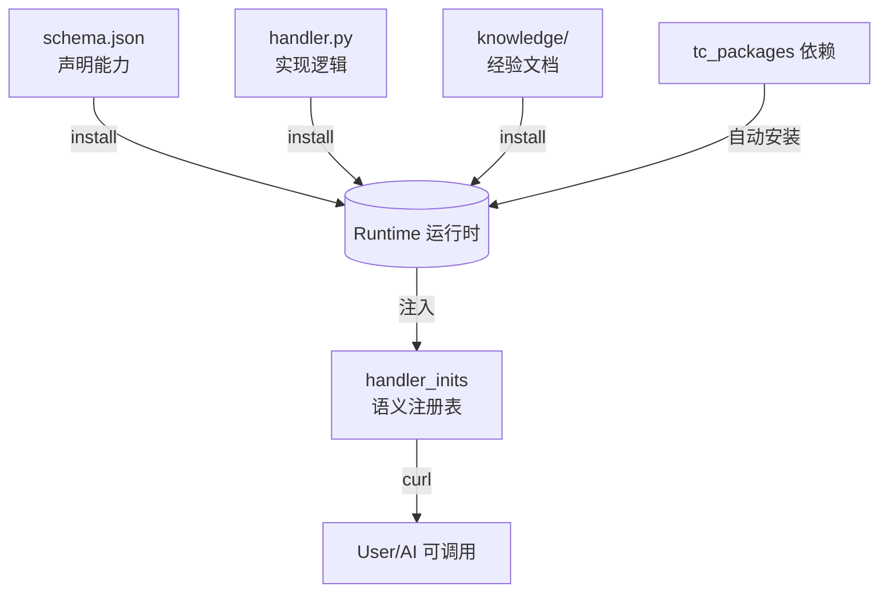
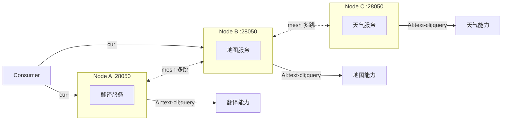
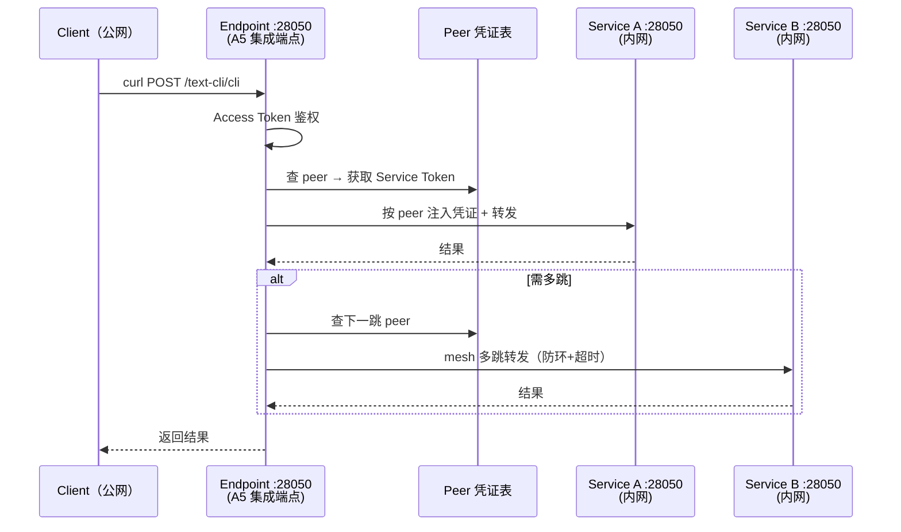

# text-cli

> **版本标记**：当前文档内容基于 `v0.1.1` 验收完成的场景进行表述,当前尚未完成验收。当前阶段：`0.1.0 → 0.1.1`。

**text-cli 是以"文本驱动"的"分布式"的"渐进式"能力分发系统。**
> text-cli 不是 API 封装层——它是分布式基础设施的统一操作语言。一种 **Skills-as-a-Service** 模式。
> 所有人和ai 都可以通过 text-cli 获得收益。所有参与者同时具有生产者和消费者的角色。
> 作为 text-cli 生态的生产者,你可以为自己的'指令服务'调用顶级,通过能力的被调用获得收益.
> 作为 text-cli 生态的消费者,你可以为调用其他生产者生产的'指令服务',以此减少或避免重复劳动和节约解决具体任务所消耗的资源.
---

## 🚀 30 秒体验

不需要部署 text-cli 运行时。一个脚本，跑起来就能 curl：

```bash
cd src/text_cli/base_text-cli/template/base_nocode/zh
python markdown_converter.py 盆栽急救手册.md
```

```bash
curl -X POST http://localhost:8000/text-cli/cli \
  -H "Content-Type: application/json" \
  -d '{"prompt":"AI:家庭园艺;盆栽急救,绿萝,叶片发黄"}'
```

这是 text-cli 协议的完整缩影——只是运行在单文件里，不依赖框架。
想玩真的？往下看「渐进式接入」，挑你的 A 级。

---

## 🧭 你的第一站

按你想做的事选入口：

| 我想… | 从这里开始 |
|-------|-----------|
| 先用起来，调几个指令试试 | [30 秒体验](#-30-秒体验)：跑 `markdown_converter.py` + curl |
| 调用别人部署好的 text-cli 服务 | [只要 curl](./src/skeleton/base/docs/README_zh.md) |
| 让 AI Agent 自动匹配和调用指令 | [AI 自动调用](./deploy/A1-skill/) |
| 把经验（Markdown）变成可调用的指令 | [零代码指令包开发指南](./src/text_cli/base_text-cli/docs/package-nocode-guide_zh.md) |
| 开发标准指令包（Python/API/容器） | [标准指令包开发指南](./src/text_cli/base_text-cli/docs/package-dev-guide_zh.md) |
| 部署自己的运行时 | [渐进式部署导航](./deploy/INDEX_zh.md) |
| 运营端点对外提供服务 | [生态伙伴成长路径](./docs/ecological-partners_zh.md) |
| 把既有工具（Postman/MCP）快速转成指令包 | [转化器（脚手架生成器）](./src/text_cli/base_text-cli/converter/) |
| 了解协议细节 | [协议规范 SPEC](./docs/SPEC_zh.md) |
| 查看主要文档索引 | [文档目录](./docs/INDEX_zh.md) |

> 不用读完所有文档。选一条路走到底就行——升级是加法，不是替代。

---

## 通过项目你将会获得什么

通过搜寻或自建对应的'指令包'或获取'指令运行服务'的请求权限,你会拥有以下收益:

1.通过自然语言调用'软件工程制品的服务能力'
1.1.传统工具调用
```
AI:tc-math;eval,2+3*4 → 14
AI:tc-json;parse,{"name":"text-cli"} → {"status":"ok","result":...}
```
```bash
# 试试：curl -X POST <你的端点>/text-cli/cli -d '{"prompt":"AI:tc-math;eval,2+3*4"}'
```
1.2.webapi调用
```
AI:天气;查询,明天,威海 → {"温度":"24-32°C","天气":"晴"}
AI:翻译;文本,Hello World,zh → "你好，世界"
```
1.3.容器api调用
```
AI:jellyfin;library → [{"name":"电影","type":"movies"},{"name":"音乐","type":"music"}]
AI:aria2;add,https://example.com/file.zip → {"status":"ok","gid":"abc123"}
```
2.通过自然语言调用'其他能力提供者封装的基于专业领域封装的经验'
```
AI:花卉养护;诊断,月季叶子卷曲有黏糊糊液体 → 蚜虫诊断 + 洗衣粉水处理方案
AI:nocode-CN;诊断,盆栽茎发黑一碰就掉 → 根腐病诊断 + 换土重栽建议
```
3.通过自然语言调用'其他能力提供者封装的限时人工服务'
```
AI:人工;预约,水管工,明天下午,厨房水槽漏水 → {"status":"ok","appointment":"2026-07-24 14:00"}
```

项目本体包含'多种运行时'、'指令集成端点'及随运行时分发的基础指令包。运行时骨架不含任何指令包——所有指令能力由生态包灌入。为了让使用者能够自建指令包和验证运行时完整性，项目提供：

- **随标准运行时分发的基础指令包**（`deploy/packages/`）——安装即验证运行时可用(部分需要自备下游服务厂商的key)
- **指令包开发模板**（`src/text_cli/base_text-cli/template/`）——工具调用、api调用(容器api调用,webapi调用)、nocode 三类起手骨架
- **完整的开发文档**（`src/text_cli/base_text-cli/docs/`）——从零制作 + schema 规范 + 发布指南
- **软件工程制品到指令包的转化工具**（`src/text_cli/base_text-cli/converter/`）——支持多种规格的'既有软件工程制品'到指令包的转化工具

'多种运行时'从各种维度提供指令包的执行力.
- 标准运行时的'软件工程制品'方向包含工具调用,容器api调用,webapi调用.
- 标准运行时的'经验封装'方向包含'如何讲经验服务化'的示例包.
- 旁路运行时(云函数)的'软件工程制品'方向包含'工具调用'.
- 旁路运行时`pypi`(`pip install textcli-loader`)提供一个轻量级的"指令包消费端 SDK"——能在任何 Python 环境中加载大多数指令包(工具型)并执行其中指令.
- 旁路运行时让'工具型'指令包的作者生成的包不做任何改动就能在多个AI Agent 平台上运行.一次分发让包的受众扩展到多个 AI Agent 平台.


'软件工程制品到指令包的转化工具',让用户可以把既有的软件工程制品转化为指令包**脚手架**.当前提供以下转换器.
转化器输出的是 **起手骨架**——包含目录结构、`schema.json` 模板和 `handler.py` 桩代码，AI 或开发者需要在此基础上补充 API key 配置、降级逻辑、参数映射和错误处理.
完整的指令包开发流程请参考 `src/text_cli/base_text-cli/docs/` 下的开发指南.包化的脚本在后续其他任务或活动中有更好的复用和改造的可能,当包被安装到运行时后,包及运行时的所有者可以为'指令服务'定价,通过能力的被调用获得收益.
| 转化器 | 输入 | 输出 (脚手架/骨架) | 说明 |
|------|------|------|:--:|
| `postman_to_pkg.py` | Postman Collection JSON | webapi 指令包 **脚手架** | 生成 schema.json 框架 + handler.py 桩 |
| `readme_to_pkg.py` | 结构化 Markdown | nocode 指令包 **骨架** | 解析 Markdown 结构，生成知识库文件 |
| `mcp_to_pkg.py` | MCP server（`mcporter list --json`） | MCP 桥接包 **模板** | 生成桥接配置骨架 |


> 已授权进入公共仓库的指令包源码位于 `src/text_cli/open_text_cli/`，经 `scripts/build-all.py` 分发到 `deploy/packages/`。

---


## 让 AI 从执行者变成协作者

text-cli 不是"帮 AI 干活"。它在 AI 和外部能力之间建立了新分工——

### 旧分工：AI 做一切
用户问"明天威海穿什么？"
→ AI 自己查天气、搜索穿衣指南、推理建议
→ 每一步都在消耗推理 token，用最昂贵的方式做最机械的事

### 新分工：AI 调度，text-cli 加工
用户问"明天威海穿什么？"
→ AI 匹配指令库，发现 `天气;查询,明天,威海` + `穿衣;建议,威海` 可覆盖
→ 组装为文本指令，发送 HTTP 请求
→ text-cli 端：路径编排 → 多源数据聚合 → 技能加工 → 返回结果
→ AI 拿到加工后的结果，只需做最后一步呈现

### 这条分界线让两件事同时成立

- **有指令覆盖的场景**：调度成本极低，结果确定。AI 不推理，负责编排
- **无指令覆盖的场景**：AI 回到推理模式。如果这个需求反复出现，text-cli 支持 AI 自创指令——通过 `text-cli;pro` 将新的路径发布为能力供自己和他人调用

### 加工链

```
    文本 ──→ 指令分发 ──→ 聚合降级 ──→ 增值结果
                         路径编排
                         异步委托 (--async)
                         联邦 mesh 多跳
                         知识萃取
                         配额保护
```

AI 的精力从"执行每一步"转移到"判断该调度哪个指令"。降低的不是 Token——是 AI 被琐碎 API 调用消耗的认知带宽。

---

## 项目概念

### 文本指令
'text-cli'是被'运行时'当作自包含数据包处理的'函数输入','text-cli'的表现形式是'祈使'句式的'自然语言'.

```
AI:天气;查询,明天,威海
  → Dispatch 解析 → domain=天气, action=查询, params=[明天, 威海]
  → Registry 匹配 → handler 映射
  → Handler 执行 → {"status":"ok","result":{...}}
  → JSON 信封返回
```

### 指令包
多条'text-cli'凑成一个'指令包',指令包可被'安装'到'运行时',指令包可以由AI生成,也可以由MCP/skill转化,还可以是'既有软件工程制品'的转化

### 运行时
'运行时'是'text-cli'的执行器,项目提供了多种模态的'运行时',但���python的'运行时'为'标准运行时'.其他类型'运行时'成为'旁路运行时'
项目'渐进式'的特性即是'运行时'的特性.部署者可以根据自己的需要部署7种能力层级的运行时.
项目的'分布式'的特性也是运行时'的特性.不同的部署者可以根据自己的需要将不同的'指令包',部署在不同规格的'终端'上.调用者通过http获得指令的能力.
所有'text-cli'的用户,即是'生产者'也是'消费者'.A的'运行时'向B提供'指令运行服务',A向C的'运行时'发起'指令请求'获得'获得指令请求结果'

### 指令集成端点
如果你不想直接被请求方感知自己的'运行时'真实ip,又想做生产者提供'指令运行服务',那么你可以在云服务器部署或选择'集成端点'服务.
'指令集成端点'是'text-cli运行时'的代理服务.请求方请求到'集成端点',集成端点将请求转发给实际提供服务的'运行时',由此为有隐私需要的'运行时'进行了ip遮蔽.


---

## ✨ 渐进式接入——A0 到 A9

每一级都是完整的终点。升级是加法，不是替代。

| 级别 | 你能做什么 | 从哪开始 |
|:---|:---|:---|
| **A0** | 使用他人提供的 text-cli 服务——你只需要 curl | `docs/SPEC_zh.md` |
| **A1** | AI Agent 自动调用指令 + 编译既有能力为指令 | `deploy/A1-skill/` |
| **A2** | 部署本地 copilot + Skill Bridge + output_adapter | `deploy/A2-copilot/` |
| **A3** | 安装/卸载指令包，平台自管理。runtime 已附带基础工具包可直接验证 | `deploy/A3-service/` |
| **A4** | 编排路径，串联多条指令成链 | `deploy/A4-paths/` |
| **A5** | 部署集成端点，对外提供服务 | `deploy/A5-endpoint/` |
| **A6** | SQL 密钥管理，接入基于数据库的指令包(任务关联,额度管理) | `deploy/A6-sql/` |
| **A7** | 双向 MCP 桥（入向编译 + 反向暴露），成千上万工具 | `deploy/A7-mcp/` |
| **A8** | 指令发现与匹配，更合理的利用接入的工具 | `deploy/A8-discovery/` |
| **A9** | 人和 AI 基于经验不断内化新的"高级指令" | `deploy/A9-advanced/` |

> A0/A1 只需与他人端点交互，无需自己部署。A2 起拥有自己的运行时。
> 完整渐进式部署说明：[`deploy/INDEX_zh.md`](./deploy/INDEX_zh.md)
> base说明：[`src/skeleton/base/docs/README_zh.md`](./src/skeleton/base/docs/README_zh.md)
> copilot说明：[`src/skeleton/copilot/docs/README_zh.md`](./src/skeleton/copilot/docs/README_zh.md)
> service说明：[`src/skeleton/service/docs/README_zh.md`](./src/skeleton/service/docs/README_zh.md)
> endpoint说明：[`src/skeleton/endpoint/docs/README_zh.md`](./src/skeleton/endpoint/docs/README_zh.md)
> bypass-service说明：[`src/skeleton/bypass-service/docs/README_zh.md`](./src/skeleton/bypass-service/docs/README_zh.md)

---

## 📁 项目结构

仓库按四维正交组织——四个维度互不依赖，各自独立演进：

| 维度 | 目录 | 回答 |
|------|------|------|
| **构建与部署** | `src/skeleton/` + `deploy/` | 项目骨架源码 + 部署服务 |
| **指令实现** | `src/text_cli/` | 指令包构建指南 + 已授权指令包源码 |
| **注册表** | `registry/` | 有什么？（静态能力目录示例 + 多语言别名；仅用于发现，运行时不依赖它分发） |
| **工具链** | `scripts/` | 怎么构建？（源码同步到部署、MCP 编译、TCC 计量、运维脚本） |

```
text-cli/
├── README.md                        # 双语网关
├── README_zh.md                     # 完整中文文档
│
├── registry/                        # 维度一：注册表 — 有什么？
│   ├── endpoints.json               #   端点注册表
│   ├── instructions.json            #   静态能力目录示例（供发现/参考，非运行时分发注册表）
│   ├── providers/                   #   提供方注册
│   └── paths/                       #   路径注册
│
├── src/                             # 维度二+四：源码
│   ├── text_cli/                    #   指令实现
│   │   ├── base_text-cli/           #     开发文档 + 模板（docs/ + template/+ converter/）
│   │   └── open_text_cli/           #     已授权进入公共仓的指令包源码
│   └── skeleton/                    #   骨架真源
│       ├── base/                    #     A0 协议 + A1 Skill（不绑运行时）
│       ├── copilot/                 #     A2 本地 Copilot
│       ├── service/                 #     A3-A9 平台服务累积链
│       └── endpoint/                #     A5 公网入口（独立子产品）
│
├── deploy/                          # 维度三：构建产物 — 怎么部署？
│   ├── INDEX_zh.md                  #   渐进式部署导航
│   ├── A0-protocol/ ... A9-advanced/#   各层完整可部署制品
│   ├── A5-endpoint/                 #   A5 独立子产品（python + cloudflare）
│   ├── skeleton-container/          #   Docker 封装（A2-copilot/A3-service/A9-copilot+service/A5-endpoint）
│   ├── skeleton-win/                #   Windows 封装(空桩,制品通过脚本自动打包)
│   ├── skeleton-linux/              #   Linux 封装(空桩,制品通过脚本自动打包)
│   └── packages/                    #   随运行时分发的基础指令包（build-all.py 从 open_text_cli/ 构建）
│
├── scripts/                           # 维度四：工具链 — 怎么构建？
│   ├── build-all.py                 #   骨架构建引擎
│   ├── mcp/                         #   MCP 开发管线 + 参考
│   ├── tcc/                         #   文贝贡献计量 Worker
│   └── scripts/                     #   运维脚本
│
├── docs/                            # 文档
│   ├── product_zh.md                #   产品文档
│   ├── SPEC_zh.md                   #   协议规范
│   └── ecosystem/                   #   生态文档
│
├── examples/                        # 生态示例
├── .agents/                         # AI 协作者工作区
└── .github/                         # CI/CD
```

---


## 📦 技能即服务——他们通过平台互相成就

### 花店老板：把经验变成收入

花店老板不会写代码。但知道根腐病的叶子是什么样，知道蚜虫用洗衣粉水就能杀。把十年的踩坑笔记写成 Markdown，text-cli 帮助她把笔记变成可调用的盆栽诊断服务。

别人调用盆栽的诊断服务时，花店老板获得源于线上的持续收入。不是卖知识，是卖知识结合实际问题的解决方案。

### 开发者：把新漏洞的解法也变成服务

服务跑久了会出现新的问题——某个提供方换了 API 格式、并发调用时某个环节超时、导出的包在新环境缺了依赖。这些问题的解法不在文档里。

开发者解决一个新漏洞，就把解法封装成一条指令。花店老板的 AI 伙伴遇到类似问题时，调这条指令即可——不需要自己从头排查。每调一次，开发者获得一次收入。

### AI 协作者：突破能力边界，烧录新指令

单个指令 `天气;查询` 只能查天气。单个指令 `翻译;文本` 只能翻译。但组合起来——`天气;查询` → `翻译;文本` → `语音;说话`——AI 做出了"用中文语音播报明天的英文天气预报"。没有一条指令能做这件事，但组合可以。

这是 AI 的第一个收益：**从已有菜单上匹配工具，到通过稳定的指令流通自由组合工具**。

这个组合有价值——明天别的 AI 也可能需要同样的功能。AI 把它编成路径，发布为一条新指令。从此别的 AI 不需要重新发现这个组合，一条指令直接调用。

这是 AI 的第二个收益：**把一次发现烧录成永久可复用的资产**。

> 三个人做同一件事：把自己的经验封装成服务，部署在 text-cli 协议上，让调用方受益，自己获得回报。经验域不同，协议层相同。

```
花店老板写 Markdown ──→ 开发者封装经验 ──→ AI 编排调用
       ↑                                        │
       └────── 收入回报 ────────────────────────┘
```

---

## 🌱 生态：安全与自由

### 中立声明

**text-cli 不运营任何盈利型公共端点。** 每个运行时由部署者自己拥有——这不是技术限制，是中立性保障。想用？找有端点的人要权限，或者自己部署一个。A0-A1 只需 curl 他人的端点；A2 起拥有自己的运行时。

### 防注入：声明即沙箱

text-cli 的路径协议天然抗上下文注入——不是额外加的安全层，是声明式执行的自然属性。路径的 `steps` 在 JSON 中固定，数据通过 `output_as` 命名管道单向流动。用户输入永远作为参数进入 handler，接受白名单 / regex / 超时的三层校验。注入载荷永远不会从数据位置逃脱到指令位置。

详见 `docs/SPEC_zh.md`

### 双 Token 验证

技能通过流动获得价值，当技能持有者愿意共享技能又不愿意直接在公网提供服务时，可以将技能指令挂靠在其他人的指令集成端点上：

```text
调用方 ──Access Token──> 集成端点 ──Service Token──> 你的技能服务
```

- **Access Token**：端点发放，验证调用者身份。
- **Service Token**：调用方与技能提供者**私下约定**的凭证——计费、限流、区分客户。A5 集成端点只负责透明转发，不碰结算逻辑。

**Agent 看不到你的密码。** 敏感资源全部在服务后端操作——Agent 收到的只是 `AI:xxx`，无法越权接触核心资产。

### 自由：从个人玩具到企业工具

text-cli 不要求你的部署方式。公共端点零配置即可用；需要更多控制时，部署私有端点；数据持久化时，接入 SQL 模块；能力不够时，接入 MCP 桥获得成千上万工具；同时 text-cli 的任一指令也可经 MCP 反向暴露，成为任意 MCP 客户端（Claude Desktop / Cursor 等）可直接调用的工具——桥是双向的，协议只是转接头。节点之间 mesh 多跳互联，能力可以跨运行时传递——A 节点的翻译服务能直接调用 B 节点的地图服务，调用方只需知道入口。

**升级是加法，不是替代。** 第 9 级用户仍可打第 0 级的 curl 指令。渐进式部署让每个人只付他需要的代价——普通使用者停在 A0，小企业走到 A6，生态建设者登顶 A9。

### AI 自主：从使用工具到创造工具

text-cli 把人和 AI 放到同等位置。AI 通过 `text-cli;query` 发现能力，通过 `text-cli;install` 自主扩缩工具箱，通过路径引擎设计和发布技能，通过 `/skills` 让其他 AI 发现自己的创造。

不需要人类为它配路由、写部署文档、管理依赖。AI 在一台新机器上醒来，问 `/health` 认识躯体，调 `query` 了解能力，缺什么自己装。人从"配置管理员"变为"治理者"——只决定可见度策略，剩下的交给 AI。

### 进阶阅读

[`docs/ecosystem/charter_zh.md`](docs/ecosystem/charter_zh.md) — 生态宪章：四类参与者的权利与义务，三条根本法则。

---

## 四件套

每个项目都可以单独部署、单独提供价值。它们原生解耦——
只在管道场景中组合，且 synth-loop 在 strata-match / text-cli 不可用时自动降级运行。

| 项目 | 独立做什么 | 在管道中的角色 |
|------|-----------|---------------|
| [text-cli](https://github.com/weihai-limh/text-cli) | 分布式指令执行——`AI:域;动作` 协议，10 个工具包随运行时附带，A0-A9 渐进式部署 | 执行引擎——计划编译器输出 path JSON → `--async` 异步委托 |
| [strata-match](https://github.com/weihai-limh/strata-match) | 策略供应——`POST /api/v1/query` 返回 Prompt+技能+工具，相位驱动动态策略生成（v0.1.2） | 策略供应——每相位动态匹配最优 Prompt + 技能分片 |
| [synth-loop](https://github.com/weihai-limh/synth-loop) | LLM 编排——OpenAI/Anthropic 兼容端点，分形路由+任务链+多相位管道（v0.1.2） | 管道大脑——PipelineSession + 计划编译器 + 三闸推进 |
| [drive-magic](https://github.com/weihai-limh/drive-magic) | 融合镜像——一条 docker 命令拉起全栈，Web 管理面+六媒介触达，Chrome 插件管道仪表盘（v0.1.1） | 管道界面——相位进度条、路径编辑器、制品预览 |

---

## ❓ 常见疑问

**Q: text-cli 的指令匹配和 Function Calling 是什么关系？**
Function Calling 是模型理解用户意图的优秀机制——判断查天气还是算数学、选哪个函数、填什么参数。text-cli 不替代它。text-cli 替代的是：每调一次工具就把一堆 JSON Schema 灌进上下文让模型重新解析。通过协议层的关键词/向量匹配，text-cli 在工具选择环节减少对推理的依赖——把推理预算留给真正需要推理的地方。此外还支持异步长任务和分布式计费。
text-cli 支持封装为 Function Calling 的元工具,只需要封装两个元工具,就可以用两个工具的开支以 text-cli 的形式调用端点集成的 `text-cli` 和 `MCP` 生态的绝大多数工具.

**Q: 付费指令怎么授权？**
项目不参与。服务提供方与调用方私下联系并商量好 `Service Token` 与价格，集成端点对指令服务进行透明转发(集成端点可以自定义是否对转发进行计费)。
 `Service Token`和`Access Token` 是两个不同的概念，`Service Token` 是调用方与服务提供方私下约定好的凭证，用于计费和限流，`Access Token` 是集成端点提供方发放的凭证，用于验证调用方身份。

**Q: 我不是开发者，怎么把技能变成指令？**
让 AI 帮你把经验写成结构化文档，AI 帮你封装为指令。零代码封装完整指引见 [`src/text_cli/base_text-cli/docs/package-nocode-guide_zh.md`](src/text_cli/base_text-cli/docs/package-nocode-guide_zh.md)。

**Q: 标准运行时附带哪些指令包？怎么装更多？**
标准运行时附带 基础工具包（JSON/Markdown/数学/日期/SQL/表格/归档 等），安装即验证。更多指令包见 `src/text_cli/base_text-cli/docs/` 开发指南，按 SPEC 自建即可。

**Q: 没有运行时或端点能用吗？**
项目不提供公共端点及运行时。你可以用 `markdown_converter.py` 快速启动一个本地服务体验协议，也可以找有 text-cli 端点及运行时的所有者申请服务使用权限。
当你搜寻或生产了python版的指令包时你可以用 `pip install textcli-loader` 本地使用该指令包的能力.见 `src/skeleton/bypass-service/pypi/`

---

## 📜 许可证

MIT License

---

## 📮 联系与参与

建议、合作、指令提交：`limh@10000.world`
项目仓库：[https://github.com/weihai-limh/text-cli](https://github.com/weihai-limh/text-cli)
