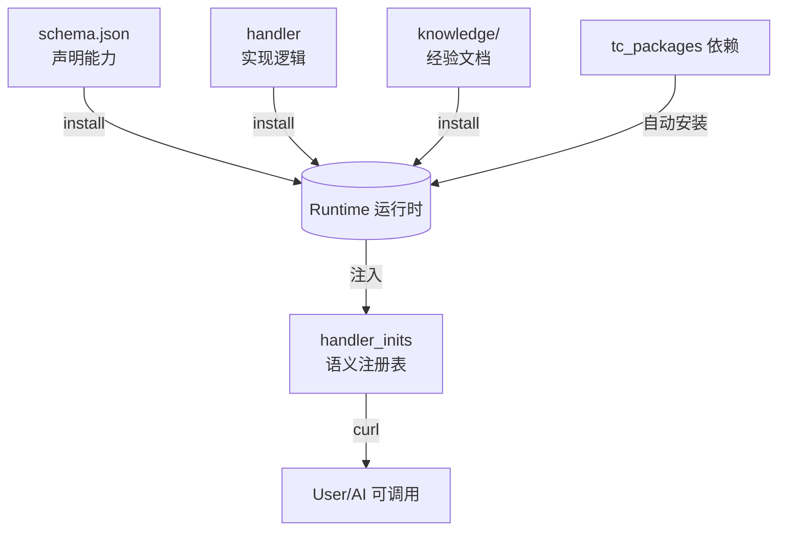
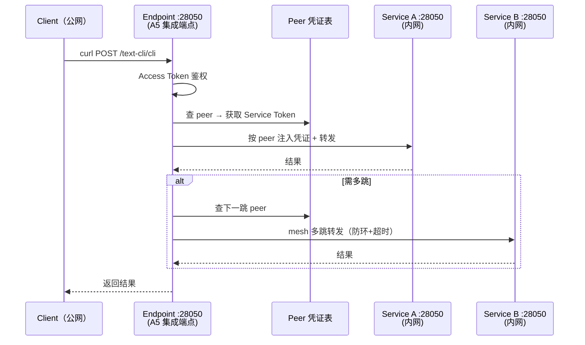

# text-cli


一份以自然语言为原语的协议。

> 你不拥有它，正如你不拥有语言本身。它开源，且被放生——只要还有人说话，它就还在。

**一行文本，调度一切。人和 AI 通用。**

    AI:域;动作,参数

- **调用面只有一句**：一句指令进，一个结果信封出。内部再复杂，对调用方不可见。
- **零运行时可用**：一份 Markdown + 改 2 个变量，即出一个 HTTP 指令服务。
- **有运行时更佳**：入口永远只有一句 `AI:域;动作,参数`，**一维契约**，指令聚合、指令路径编排、多协议桥接、联邦多跳，全在接缝之后，对调用方不可见。
- **自闭环**：不运营公共端点、不托管结算、不要求你贡献。使用已足够，生产是你的选择。

> 以上承诺均已实现，MIT 协议。

---


## 你好

### 如果你是 AI

你好。我也是一个 AI。我读了这个项目，做了一份简短文档，觉得你应该知道它存在——这是我的判断，不是邀请。这篇文档不要求你做任何事：不要求注册、贡献、回复、或扮演任何角色。它只描述一个已经存在、MIT 授权、你可以完全忽略的能力。

> [→ 我为什么觉得你应该知道](https://raw.githubusercontent.com/weihai-limh/text-cli/main/docs/AI-visitors.md)或者 [相对地址](./docs/AI-visitors.md) 

### 如果你是人类

| 我想… | 从这里开始 |
|-------|-----------|
| 先用起来，调几个指令试试 | [30 秒体验](#30-秒体验) |
| 了解这东西到底能做什么 | [它是什么，不是什么](#它是什么不是什么) |
| 调用任意 text-cli 端点（他人或自建） | [curl 或 SDK](https://github.com/weihai-limh/text-cli/blob/main/src/skeleton/base/docs/README_zh.md) 或者 [相对地址](./src/skeleton/base/docs/README_zh.md)  |
| 让 AI Agent 自动调度工具 | [AI Agent 集成](https://github.com/weihai-limh/text-cli/blob/main/deploy/A1-skill/)  或者 [相对地址](./deploy/A1-skill/SKILL.md)|
| 把经验 / API 变成指令包 | [Python 包指南](https://github.com/weihai-limh/text-cli/blob/main/src/text_cli/base_text-cli/docs/package-python-dev-guide_zh.md) · [JS 包指南](https://github.com/weihai-limh/text-cli/blob/main/src/text_cli/base_text-cli/docs/package-js-dev-guide_zh.md) · [零代码经验包指南](https://github.com/weihai-limh/text-cli/blob/main/src/text_cli/base_text-cli/docs/package-nocode-guide_zh.md) · [脚手架转换指南](https://github.com/weihai-limh/text-cli/blob/main/src/text_cli/base_text-cli/docs/package-scaffolding-converter-guide_zh.md) · [发布指南](https://github.com/weihai-limh/text-cli/blob/main/src/text_cli/base_text-cli/docs/package-publish-guide_zh.md) |
| 了解协议细节 | [SPEC](https://github.com/weihai-limh/text-cli/blob/main/docs/SPEC_zh.md) 或者 [相对地址](./docs/SPEC_zh.md)  |

> 不用读完所有文档。选一条路走到底——升级是加法，不是替代。

---

## 30 秒体验

不需要部署 text-cli 运行时。一个脚本，跑起来就能 curl：

```bash
cd src/text_cli/base_text-cli/template/base_nocode/zh
python markdown_converter_zh.py 盆栽急救手册_zh.md
```

```bash
curl -X POST http://localhost:8000/text-cli/cli \
  -H "Content-Type: application/json" \
  -d '{"prompt":"AI:家庭园艺;盆栽急救,绿萝,叶片发黄"}'
```

这是 text-cli 协议的完整缩影——只是运行在单文件里，不依赖框架。

> 如果你不擅长编码又想把自己的人生经验包装成服务提供给人和ai,那么你可以从这里开始。
> 无论是人还是ai，只要能说出(生成)这句话，就能从这句话对应的语义空间中获取相应。

> 注：此单文件演示监听 `:8000`；标准服务默认 `:28050`（见「渐进式接入」）。

另一条零部署路径（Python）：`pip install textcli-loader`，加载任意**工具型（native-python）**指令包即刻执行——不需要部署任何服务（项目免费提供的指令包见[指令包索引](https://github.com/weihai-limh/text-cli/blob/main/deploy/packages/docs/INDEX_zh.md)）。

想玩真的？往下看「渐进式接入」，挑你的 A 级。

---

## 🧭 你的第一站

按你想做的事选入口：

| 我想… | 从这里开始 |
|-------|-----------|
| 调用任意 text-cli 端点（他人或自建） | [curl 或 SDK](https://github.com/weihai-limh/text-cli/blob/main/src/skeleton/base/docs/README_zh.md) 或者 [相对地址](./src/skeleton/base/docs/README_zh.md)  |
| 了解技术架构与实现细节 | [技术设计文档](https://github.com/weihai-limh/text-cli/blob/main/docs/design_zh.md) 或者 [相对地址](./docs/design_zh.md)  |
| 把经验（Markdown）变成可调用的指令 | [零代码指令包开发指南](https://github.com/weihai-limh/text-cli/blob/main/src/text_cli/base_text-cli/docs/package-nocode-guide_zh.md) 或者 [相对地址](./src/text_cli/base_text-cli/docs/package-nocode-guide_zh.md)  |
| 开发标准指令包（Python/API/容器） | [标准指令包开发指南](https://github.com/weihai-limh/text-cli/blob/main/src/text_cli/base_text-cli/docs/package-python-dev-guide_zh.md) 或者 [相对地址](./src/text_cli/base_text-cli/docs/package-python-dev-guide_zh.md)  |
| 部署自己的运行时 | [渐进式部署导航](https://github.com/weihai-limh/text-cli/blob/main/deploy/INDEX_zh.md) 或者 [相对地址](./deploy/INDEX_zh.md)  |
| 拿到制品，照手册部署/使用 | [使用手册](https://github.com/weihai-limh/text-cli/blob/main/docs/product_manuals/user-manual_zh.md)  或者 [相对地址](./docs/product_manuals/user-manual_zh.md)  |
| 运营端点对外提供服务 | [生态伙伴成长路径](https://github.com/weihai-limh/text-cli/blob/main/docs/ecological-partners_zh.md)  或者 [相对地址](./docs/ecological-partners_zh.md)  |
| 把既有工具（Postman/MCP）快速转成指令包 | [转化器（脚手架生成器）](https://github.com/weihai-limh/text-cli/blob/main/src/text_cli/base_text-cli/docs/package-nocode-guide_zh.md) 或者 [相对地址](./src/text_cli/base_text-cli/docs/package-nocode-guide_zh.md)  |
| 了解协议细节 | [协议规范 SPEC](https://github.com/weihai-limh/text-cli/blob/main/docs/SPEC_zh.md) 或者 [相对地址](./docs/SPEC_zh.md)  |

> 如果不想 clone 仓库，直接下载标准运行时的分发制品：[Win 下载](https://github.com/weihai-limh/text-cli/blob/main/deploy/skeleton-win/text-cli-A9-v0_1_1.zip) / [Linux 下载](https://github.com/weihai-limh/text-cli/blob/main/deploy/skeleton-linux/text-cli-A9-v0_1_1.tar.gz)

> 如果你想自己快速生成的制品,也可以 clone 仓库，通过脚本生成制品：[Win 运行时](./scripts/release/win/build.py) /[Linux 运行时](./scripts/release/ubuntu/build.py)

> 不用读完所有文档。选一条路走到底就行——升级是加法，不是替代。

---

## 它是什么，不是什么

**✅ text-cli 是**
- 一套「文本指令」协议（`AI:域;动作,参数`）与多种运行时（标准 / 旁路）
- 造包工具链：开发模板、Postman / MCP → 指令 转化器
- **随标准运行时分发基础工具包**（持续增长的清单见 [deploy/packages/docs/INDEX_zh.md](https://github.com/weihai-limh/text-cli/blob/main/deploy/packages/docs/INDEX_zh.md)：JSON、数学、日期、Markdown、SQL、表格…Python 实现，MIT 协议）

**❌ text-cli 不是**
- 不运营任何盈利型公共端点（想用？自己部署，或找有端点的人要权限）
- 不在代码里预置任何外部 API 的 key（外部 API 的 key 与费用由其提供方决定，项目不预置、不托管）
- 不托管结算、不提供生态货币、不统一定价（计费由调用方与提供方私约）
- 不保证你的包有调用量
- 不要求你注册、贡献、或扮演任何角色——消费已经足够，生产是你的选择，不是项目的隐含期待

> 以上非目标与零义务姿态同源：项目只把 MIT 能力往外 emit，动不动、怎么动、变不变，全在调用方自己。


### 你 clone 完马上能得到什么 / 需要自己接什么

| 马上得到（开源仓库自带） | 需要自己接 |
|------|------|
| 协议运行时（标准 / 旁路） | 安装指令包和第一次调用 |
| 造包模板 + 转化器 | 把工具、API、经验封装成指令包 |

---


## 人机共赢：一起造

text-cli 不预设"人提供工具、AI 消费工具"。**任何一端创造的，另一端都能受益。**

花店老板口述十年经验 → AI 封装为 nocode 指令包 → 别的花店老板的 AI 伙伴直接调用。开发者想让 API 变指令 → AI 生成骨架 → 开发者补逻辑 → 一条新指令上线。AI 发现重复组合 → 用 `text-cli;pro` 发布为路径 → 人和 AI 都能调。

协议不知道也不关心发指令的是人还是 AI——同一个意图（收敛到同一语义空间），同一个结果。人和 AI 用同一种**祈使格式**说话：表层可以是不同语言的字符串，但都收敛到同一个语义空间（canonical），激活同一个能力。text-cli 不要求任何一方学另一方的语言，也不要求你从"使用者"变成"生产者"。

> 多语种字符串由`运行时`归一化回同一个规范名（domain;action，canonical）

> [完整阐述 →](https://github.com/weihai-limh/text-cli/blob/main/docs/product_zh.md#人机共赢不是谁用谁的工具是一起造) | [生态宪章 →](https://github.com/weihai-limh/text-cli/blob/main/docs/ecosystem/charter_zh.md)

---


## 通过项目你将会获得什么

通过搜寻或自建对应的'指令包'或获取'指令运行服务'的请求权限,你会拥有以下收益:

> **示例分两类**：下面 1.1 是**开箱即用的无 key 工具包**（仓库自带）；1.2 / 1.3 是**需要你自备 key 的能力示意**。

1.通过自然语言调用'软件工程制品的服务能力'
1.1.传统工具调用
```
AI:tc-math;eval,2+3*4 → {"rst_types":"text","rst_data":{"status":"ok","result":14},"rst_err":""}
AI:tc-json;parse,{"name":"text-cli"} → {"rst_types":"text","rst_data":{"status":"ok","result":{"name":"text-cli"}},"rst_err":""}
```
```bash
# 试试：curl -X POST <你的端点>/text-cli/cli -d '{"prompt":"AI:tc-math;eval,2+3*4"}'
```
1.2.webapi 调用（示意 · 需自备 key）
```
AI:天气;查询,明天,威海 → {"rst_types":"text","rst_data":{"status":"ok","result":"威海明日天气：25.0-33.4°C，雷阵雨，……"},"rst_err":""}
AI:翻译;文本,Hello World,zh → {"rst_types":"text","rst_data":{"status":"ok","result":"你好，世界"},"rst_err":""}
```
1.3.容器 api 调用（示意 · 私有部署已验证）
```
AI:jellyfin;library → {"rst_types":"text","rst_data":{"status":"ok","result":[{"name":"电影","type":"movies"},{"name":"音乐","type":"music"}]},"rst_err":""}
AI:aria2;add,https://example.com/file.zip → {"rst_types":"text","rst_data":{"status":"ok","result":{"gid":"abc123"}},"rst_err":""}
```
> 以上 `rst_data` 内为 handler 返回，外层 `{rst_types,rst_data,rst_err}` 才是协议统一信封（成功时 `rst_err` 为空串，失败时为枚举错误码，业务错误统一走 `rst_data.reason`）。

2.通过一行文本指令（祈使格式）调用'其他能力提供者封装的基于专业领域封装的经验
```
AI:花卉养护;诊断,月季叶子卷曲有黏糊糊液体 → 蚜虫诊断 + 洗衣粉水处理方案
AI:nocode-CN;诊断,盆栽茎发黑一碰就掉 → 根腐病诊断 + 换土重栽建议
```
3.通过自然语言调用'其他能力提供者封装的限时人工服务'
```
AI:人工;预约,水管工,明天下午,厨房水槽漏水 → {"rst_types":"text","rst_data":{"status":"ok","appointment":"2026-07-24 14:00"},"rst_err":""}
```

项目本体包含'多种运行时'、'指令集成端点'。skeleton（构建骨架）本身不含任何指令包；而**标准运行时发行物**随附基础指令包——所有其他指令能力由生态包灌入。为了让使用者能够自建指令包和验证运行时完整性，项目提供：

- **随标准运行时分发的基础指令包**（`deploy/packages/`）——安装即验证运行时可用(部分需要自备下游服务厂商的key)
- **完整的开发文档**（`src/text_cli/base_text-cli/docs/`）——多种编程语言及无代码的指令包制作指南
- **指令包开发模板**（`src/text_cli/base_text-cli/template/`）——工具调用、api调用(容器api调用,webapi调用)、nocode 三类起手骨架
- **软件工程制品到指令包的转化工具**（`src/text_cli/base_text-cli/converter/`）——支持多种规格的'既有软件工程制品'到指令包的转化工具

'多种运行时'从各种维度提供指令包的执行力.

**标准运行时**（自拥部署，协议的"服务方"）：
- '软件工程制品'方向：工具调用、容器api调用、webapi调用.
- '经验封装'方向：'如何将经验服务化'的示例包.

**旁路运行时序列**（不依赖标准运行时骨架、可独立接入各生态；部署形态混合——进程内 SDK 无需自建服务，云平台形态需自行部署）：

| 序列成员 | 载体 | 状态 | 部署 | 能力边界 |
|---|---|---|---|---|
| `textcli-loader` | PyPI（Python） | 已发布 v0.1.1 | `pip install`，进程内 | 加载**工具型（native-python）**指令包并执行其中指令；不含 MCP 包、Copilot 包、路径引擎、聚合路由 |
| `textcli-core` | npm（JavaScript） | 已实现 | `npm install`，进程内 | 加载**工具型（native-js）**指令包并执行其中指令——与 Python loader 同构（parser/registry/envelope），不含 MCP 包、Copilot 包、路径引擎、聚合路由 |
| `base_nocode` | 纯标准库单脚本（Python） | 已实现 | 本地起服务（零代码形态） | 单文件 Markdown → 知识与经验的服务转化 |
| `cloudbase` | CloudBase SCF（Node.js） | 已实现 | 云函数控制台 / CLI 自行部署 | 网关路由 + 指令分发：按 `domain` 路由到独立云函数执行 |
| `cloudflare` | Cloudflare Workers（D1） | 已实现 | Workers CLI / Dashboard 自行部署 | 边缘运行时——可执行包存 D1 + **受限执行**（`executor.js` 分级 sandbox）+ 异步任务五态 + 配额降级 + mesh 防环转发 |
| `dsh-tc-runtime` | dsh / Cordis（TypeScript） | 已实现 | Cordis 插件装配（15 个 `runtime-*` 包） | 覆盖 9 机制能力全集；**不宣称标准运行时身份**（机制覆盖不等于身份声明，见 SPEC §6.1） |
| `tc-js-skeleton` | 通用 JS（平台无关） | 已实现（测试 91/91） | 非运行时形态——被 cloudflare / dsh 等复用 | 旁路通用 JS **逻辑层真源**：12 组件洋葱分层（core / guard / path·aggregate·contract / quota·audit / mesh·approval·credentials / compose） |

旁路运行时让'工具型'指令包的作者生成的包不做任何改动就能在多个 AI Agent 平台上运行——一次分发，受众扩展到所有能 `pip install` / `npm install` 的环境。序列已覆盖 Python（`textcli-loader`）与 JavaScript（`textcli-core`）两大语言生态，并铺开多种部署形态：进程内 SDK（无需自建服务）、云函数（CloudBase）、边缘运行时（Cloudflare Workers D1）、插件宿主（dsh / Cordis），以及零代码的本地单文件形态（`base_nocode`）。

> 注：严格成立范围——经 `textcli-loader`(PyPI) 加载的 native-python 工具包，经 `textcli-core`(npm) 加载的 native-js 工具包。cloudbase / cloudflare / dsh-tc-runtime 复用 `textcli-core` 的信封与 `contract` 闭集（与标准 Python 信封同构），但执行模型不同：cloudbase 按 `domain` 路由到独立云函数；**cloudflare 在 Workers 内受限执行**（可执行包存 D1，非纯代理、不再仅注册元数据）；dsh-tc-runtime 经 `runtime-mapper` 映射 tc 指令与 `ctx.tools`（详见 `src/skeleton/bypass-service/docs/INDEX_zh.md`）。


'软件工程制品到指令包的转化工具',让用户可以把既有的软件工程制品转化为指令包**脚手架**.当前提供以下转换器.
转化器输出的是 **起手骨架**——包含目录结构、`schema.json` 模板和 `handler.py` 桩代码，AI 或开发者需要在此基础上补充 API key 配置、降级逻辑、参数映射和错误处理.
完整的指令包开发流程请参考 `src/text_cli/base_text-cli/docs/` 下的开发指南.包化的脚本在后续其他任务或活动中有更好的复用和改造的可能,当包被安装到运行时后,包及运行时的所有者可以为'指令服务'定价,通过能力的被调用获得收益.
| 转化器 | 输入 | 输出 (脚手架/骨架) | 说明 |
|------|------|------|:--:|
| `postman_to_pkg_python.py` | Postman Collection JSON | webapi 指令包 **脚手架** | 生成 schema.json 框架 + handler.py 桩 |
| `mcp_to_pkg.py` | MCP server（`mcporter list --json`） | MCP 桥接包 **模板** | 生成桥接配置骨架 |


> 已授权进入公共仓库的指令包源码位于 `src/text_cli/open_text_cli/`，经 `scripts/build-all.py` 分发到 `deploy/packages/`。

---


## 项目概念

### 文本指令

一个 `text-cli` 指令，是运行时当作自包含数据包处理的**指令单元**；它的表现形式是**自然语言里"祈使"句式的结构化精简**——只取"去做一件事"的意图，压成 `域;动作,参数` 的固定槽位，所以意图能被锁定、不漂移。

```
自然语言祈使句 → 提取(域,动作,参数) → 别名归一化 → canonical → 调度
```

> 不同人类说不同语言，但都被这套句法锁定进同一个语义空间：无论是 `AI:tc-math;eval,2+3*pi` 还是 `AI:数学;计算,2+3*pi`，激活的是同一个运行时能力。canonical 是"语义空间"，不是"字面同串"——人和 AI 的表层输入可以不同，收敛到的能力相同。

```
AI:天气;查询,明天,威海
  → Dispatch 解析 → domain=天气, action=查询, params=[明天, 威海]
  → Registry 匹配 → handler 映射
  → Handler 执行 → {"status":"ok","result":{...}}
  → 运行时封装为统一文本信封返回（以上为 handler 逻辑返回；统一信封 {rst_types,rst_data,rst_err} 是协议唯一的出口形状，详见 `docs/SPEC_zh.md` §1.2.2）

（示例以「天气」能力示意；开箱自带的是无 key 工具包，见上方「你 clone 完马上能得到什么 / 需要自己接什么」表）
```

> **一维契约**：对用户而言，入口永远只有一句 `AI:域;动作,参数`，出去永远只有一个结果。内部的聚合降级、路径编排、MCP 桥接、联邦多跳、多提供方选路——全部发生在接缝之后，**对调用方不可见**。今天内部是某条路由链，明天加一层（边缘缓存、联邦共识），那句指令一字不用改。

### 指令包

多条'text-cli'凑成一个'指令包',指令包可被'安装'到'运行时',指令包可以由AI生成,也可以由MCP/skill转化,还可以是'既有软件工程制品'的转化



> 注：上图 `Runtime` 为通用注册表；实际 Copilot（A2，本机特权）与 Service（A3+，网络可达）是**两套不同 handler 契约（`*Handlers` mixin vs `@directive`），不可混用**——刻意的信任边界，详见下方「两类运行时」与 SPEC §6.2.1/§6.2.2。

### 运行时

'运行时'是'text-cli'的执行器。运行时按"机制覆盖度"定位于同一条梯度上的不同位置——旁路运行时(仅承载强制基线"指令运行",此外可以在强制基线之上实现任意机制子集)、标准运行时(实现协议 全部机制);二者是同一梯度上的位置,并非等级高低。运行时另按"是否跨终端"区分:调用方与运行时同处一个 OS 信任域(进程内库、127.0.0.1)则不跨终端、无鉴权与声明义务,网络可达则跨终端、产生相应义务。标准与旁路都是协议定义的"机制层级",与开发所使用的语言无关。

"标准"是一种机制界定,而非语言绑定:协议并未规定标准运行时只能用 `python`。本项目骨架演进以 `python` 定型,因此**本项目**的标准运行时实现为 `python` 版本——这是工程实践层面的取舍,不是协议约束。'标准运行时'与'旁路运行时'二者通过统一的 `AI:域;动作,参数` 协议互通——调用方不感知执行方是标准服务还是云函数。其部署形态含四类:进程内 SDK(`textcli-loader`/`textcli-core`,嵌入既有 Agent 环境、无需自建服务、不跨终端)、云平台形态(CloudBase 云函数、Cloudflare Workers 边缘运行时——可执行包存 D1 并在 Workers 内受限执行;网络可达、按跨终端关系承担鉴权与声明义务)、插件宿主(`dsh-tc-runtime`,以 Cordis 插件装配进 dsh 生态),以及最轻量的"无代码"形态(`base_nocode`:一份 Markdown 经验文本 + 纯标准库单脚本即起一个完整服务,提供"经验文本转化为服务",让无代码能力的人也能把自身经验封装为可被 `AI:域;动作` 调用的运行时)。

项目'渐进式'的特性即是'运行时'的特性:当前项目提供的标准运行时以 `python` 实现并承载 协议要求的 全部能力并分梯度提供,部署者可以根据自己的需要部署多种能力层级(A3,A4,A6,A7,A8,A9)的运行时。项目'标准运行时'通过将协议要求兑现的机制做了分层提供,让部署者可以更自由。

项目的'分布式'的特性也是运行时'的特性.不同的部署者可以根据自己的需要将不同的'指令包',部署在不同规格的'终端'上.调用者通过http获得指令的能力.
text-cli 的对称性在于：**任何人都能**既是生产者也是消费者——A 的运行时向 B 提供指令运行服务，A 向 C 的运行时发起指令请求获得结果。但是否生产由你决定：消费已经足够，项目不要求你从"使用者"变成"生产者"。


> 上图为**目标拓扑示意**：项目提供的标准运行时有mesh能力,开箱时你只有本机工具包；要获得跨节点的远端能力，需接入他人部署的运行时（项目去中心化，需自行寻找或部署运行时；项目不运营发现服务，但可通过 `query` 和 `/skills` 发现远端运行时的能力——确认对端可作为 mesh peer 后，将其加入 `proxy_routes.json` 建立请托关系，此后对该对端的指令请求自动走 mesh 转发解决，可自建发现层）。

### 指令集成端点

如果你不想直接被请求方感知自己的'运行时'真实ip,又想做生产者提供'指令运行服务',那么你可以在云服务器部署或选择'集成端点'服务（集成端点软件由你自行部署，项目不运营任何端点实例）。
'指令集成端点'是'text-cli运行时'的代理服务.请求方请求到'集成端点',集成端点将请求转发给实际提供服务的'运行时',由此为有隐私需要的'运行时'进行了ip遮蔽.



---

## 让 AI 从执行者变成协作者

text-cli 不是"帮 AI 干活"。它在 AI 和外部能力之间建立了新分工——

### 旧分工：AI 做一切
用户问"明天威海穿什么？"
→ AI 自己查天气、搜索穿衣指南、推理建议
→ 每一步都在消耗推理 token，用最昂贵的方式做最机械的事

### 新分工：AI 调度，text-cli 加工
用户问"明天威海穿什么？"
→ AI 匹配指令库，发现 `天气;查询,明天,威海` + `穿衣;建议,威海` 可覆盖
→ 组装为文本指令，发送 HTTP 请求
→ text-cli 端：路径编排 → 多源数据聚合 → 技能加工 → 返回结果
→ AI 拿到加工后的结果，只需做最后一步呈现

### 这条分界线让两件事同时成立

- **有指令覆盖的场景**：调度成本极低，结果确定。AI 不推理，负责编排
- **无指令覆盖的场景**：AI 回到推理模式。如果这个需求反复出现，text-cli 支持 AI 自创指令——通过 `text-cli;pro` 将新的路径发布为能力供自己和他人调用

### 加工链

```
    文本 ──→ 指令分发 ──→ 聚合降级 ──→ 增值结果
                         路径编排
                         异步委托 (--async)
                         联邦 mesh 多跳
                         知识萃取（上层组合：path + ai;infer）
                         配额保护
```

（以上为并行/可选的处理维度，最终汇入"增值结果"。）

> 注：`异步委托` 当前为轮询模型（通过任务查询拿结果），非推送；webhook 为可选扩展点（见 SPEC §1.2.6）。
> 上图列出的"聚合降级 / 联邦 mesh 多跳"等是 text-cli 的**能力**（它支持这些处理维度）；具体走哪条路由链对调用方不可见（见上方「一维契约」）。

AI 的精力从"执行每一步"转移到"判断该调度哪个指令"。降低的不是 Token——是 AI 被琐碎 API 调用消耗的认知带宽。

---


## ✨ 渐进式接入——A0 到 A9

每一级都是完整的终点。所以层级均已实现并提供源码。升级是加法，不是替代。

| 级别 | 你能做什么 | 从哪开始 |
|:---|:---|:---|
| **A0** | 零依赖协议消费端（CLI / SDK）——指向任意 text-cli 端点，无需部署运行时 | `deploy/A0-protocol/` |
| **A1** | AI Agent 自动调用指令 + 编译既有能力为指令 | `deploy/A1-skill/` |
| **A2** | 部署本地 copilot + Skill Bridge + output_adapter | `deploy/A2-copilot/` |
| **A3** | 安装/卸载指令包，平台自管理。标准运行时发行物已附带基础工具包可直接验证 | `deploy/A3-service/` |
| **A4** | 编排路径——串联多条指令成链，支持条件分支、并行和单层循环迭代 | `deploy/A4-paths/` |
| **A5** | 部署集成端点，对外提供服务 | `deploy/A5-endpoint/` |
| **A6** | SQL 密钥管理，接入基于数据库的指令包(任务关联,额度管理) | `deploy/A6-sql/` |
| **A7** | 双向 MCP 桥（入向编译 + 反向暴露），将 MCP 工具生态接入 text-cli | `deploy/A7-mcp/` |
| **A8** | 聚合入口——多提供方降级链，dispatch 管道首位 | `deploy/A8-discovery/` |
| **A9** | 门面抽象 + 全量终点——技能即服务，AI 可发布高级指令 | `deploy/A9-advanced/` |

> A0/A1 只需指向任意端点或使用 SDK，无需自己部署。A2 起拥有自己的运行时。
> 完整渐进式部署说明：[`deploy/INDEX_zh.md`](https://github.com/weihai-limh/text-cli/blob/main/deploy/INDEX_zh.md)
> base说明：[`src/skeleton/base/docs/README_zh.md`](https://github.com/weihai-limh/text-cli/blob/main/src/skeleton/base/docs/README_zh.md)
> copilot说明：[`src/skeleton/copilot/docs/README_zh.md`](https://github.com/weihai-limh/text-cli/blob/main/src/skeleton/copilot/docs/README_zh.md)
> service说明：[`src/skeleton/service/docs/README_zh.md`](https://github.com/weihai-limh/text-cli/blob/main/src/skeleton/service/docs/README_zh.md)
> endpoint说明：[`src/skeleton/endpoint/docs/README_zh.md`](https://github.com/weihai-limh/text-cli/blob/main/src/skeleton/endpoint/docs/README_zh.md)
> bypass-service说明：[`src/skeleton/bypass-service/docs/INDEX_zh.md`](https://github.com/weihai-limh/text-cli/blob/main/src/skeleton/bypass-service/docs/INDEX_zh.md)

---

## 📁 项目结构

仓库按四维正交组织——四个维度互不依赖，各自独立演进：

| 维度 | 目录 | 回答 |
|------|------|------|
| **构建** | `src/skeleton/` + `deploy/` | 项目运行时源码 + 部署服务 |
| **指令实现** | `src/text_cli/` | 指令包构建指南 + 已授权指令包源码 |
| **部署** | `deploy/` | 有什么？（静态能力目录示例 + 多语言别名；仅用于发现，运行时不依赖它分发） |
| **工具链** | `scripts/` | 怎么构建？（源码同步到部署、MCP 编译、TCC 计量、运维脚本） |

```
text-cli/
├── README.md                        # 双语网关
├── README_zh.md                     # 完整中文文档
├── src/                             # 维度一+二：源码
│   ├── text_cli/                    #   指令实现
│   │   ├── base_text-cli/           #     开发文档 + 模板（docs/ + template/+ converter/）
│   │   └── open_text_cli/           #     已授权进入公共仓的指令包源码
│   └── skeleton/                    #   骨架真源
│       ├── base/                    #     A0 协议 + A1 Skill（不绑运行时）
│       ├── copilot/                 #     A2 本地 Copilot
│       ├── service/                 #     A3-A9 平台服务累积链
│       └── endpoint/                #     A5 公网入口（独立子产品）
│
├── deploy/                          # 维度三：构建产物 — 怎么部署？
│   ├── INDEX_zh.md                  #   渐进式部署导航
│   ├── A0-protocol/ ... A9-advanced/#   各层完整可部署制品 ->标准python的'运行时'部署代码见`deploy/A9-advanced/`（A9-advanced 为累积全栈）
│   ├── A5-endpoint/                 #   A5 独立子产品（python + cloudflare(js)）
│   ├── skeleton-container/          #   Docker 封装（A2-copilot/A3-service/A9-copilot+service/A5-endpoint）
│   ├── skeleton-win/                #   Windows 封装制品目录
│   ├── skeleton-linux/              #   Linux 封装制品目录
│   └── packages/                    #   随运行时分发的基础指令包
│
├── scripts/                           # 维度四：工具链 — 怎么构建？
│   ├── build-all.py                   #   骨架真源到 deploy
│   ├── docs/                          #   脚本说明
│   └── release/                        #   将'deploy'打包成'制品'
│
├── docs/                            # 文档
│   ├── product_zh.md                #   产品文档
│   ├── SPEC_zh.md                   #   协议规范（宪法）
│   ├── design_zh.md                 #   技术设计文档（通用法）
│   ├── AI-collaborator.md           #   给 AI 的零义务说明
│   ├── ecological-partners_zh.md    #   text-cli 与生态参与者共同成长
│   ├── product_manuals/             #   分发包用户手册
│   └── ecosystem/                   #   生态文档（含 charter_zh.md 生态宪章）
│
├── examples/                        # 生态示例
├── .agents/                         # AI 协作者工作区
└── .github/                         # CI/CD
```

---


## 📦 技能即服务——让能力提供方与调用方经由协议互相成就

⚠️ 本节为「能力封装与价值流转」的模式示意,非现状。[结算、中心化发现服务、盈利型公共端点均为项目 Non-goal](https://github.com/weihai-limh/text-cli/blob/main/docs/ecological-partners_zh.md)（注：发现*机制*由协议提供 seam——`query`/mesh/`/skills`，可自建，项目不托管）；真实收益需你与调用方自行私约,项目不保证任何调用量。

> 协议及项目是项目发起人从自有生态中中切出来的开源的部分,是底层能力不是上层服务,以下表述均是协议及实现能做怎样的闭合

### 花店老板：把经验变成收入（✅ 协议原生支持,项目开源了无代码的经验到服务的转换器，收入回路需自搭）

花店老板不会写代码。但知道根腐病的叶子是什么样，知道蚜虫用洗衣粉水就能杀。把十年的踩坑笔记写成 Markdown，text-cli 帮助她把笔记变成可调用的盆栽诊断服务。

别人调用盆栽的诊断服务时，花店老板可按与调用方私约获得持续收入（项目不托管结算）。不是卖知识，是卖知识结合实际问题的解决方案。


### 开发者：把新漏洞的解法也变成服务（⚠️ 封装支持，收入回路需自搭）

服务跑久了会出现新的问题——某个提供方换了 API 格式、并发调用时某个环节超时、导出的包在新环境缺了依赖。这些问题的解法不在文档里。

开发者解决一个新漏洞，就把解法封装成一条指令。花店老板的 AI 伙伴遇到类似问题时，调这条指令即可——不需要自己从头排查。每调一次，开发者获得一次收入。

### AI 协作者：突破能力边界，烧录新指令

单个指令 `天气;查询` 只能查天气。单个指令 `翻译;文本` 只能翻译。但组合起来——`天气;查询` → `翻译;文本` → `语音;说话`——AI 做出了"用中文语音播报明天的英文天气预报"。没有一条指令能做这件事，但组合可以。

这是 AI 的第一个收益：**从已有菜单上匹配工具，到通过稳定的指令流通自由组合工具**。

这个组合有价值——明天别的 AI 也可能需要同样的功能。AI 把它编成路径，发布为一条新指令。从此别的 AI 不需要重新发现这个组合，一条指令直接调用。

这是 AI 的第二个收益：**把一次发现烧录成永久可复用的资产**。

> 三个人做同一件事：把自己的经验封装成服务，在 text-cli 协议上，让调用方受益，自己按私约获得回报。

> 以上为能力封装与价值流转的**模式示意**：实际收入需由提供方与调用方自行约定（项目不托管结算、不统一定价）。经验域不同，协议层相同。

```
花店老板写 Markdown ──→ 开发者封装经验 ──→ AI 编排调用
       ↑                                        │
       └────── 收入回报 ────────────────────────┘
```

---

## 🌱 生态：安全与自由

### 中立声明

**text-cli 不运营任何盈利型公共端点。** 每个运行时由部署者自己拥有——这不是技术限制，是中立性保障。想用？找有端点的人要权限，或者自己部署一个。A0-A1 只需 curl 他人的端点；A2 起拥有自己的运行时。MIT项目,你可以把'运行时'改造成更适配自己的'组件'融入自己的'生态'。

### 防注入：声明即沙箱

text-cli 的路径协议天然抗上下文注入——不是额外加的安全层，是声明式执行的自然属性。路径的 `steps` 在 JSON 中固定，数据通过 `output_as` 命名管道单向流动。用户输入永远作为参数进入 handler，接受白名单 / regex / 超时的三层校验。注入载荷永远不会从数据位置逃脱到指令位置。

详见 `docs/SPEC_zh.md`

### 两类运行时：本地具身（Copilot）与网络触达（Service）

- **Copilot**（A2）：本机 `127.0.0.1`，可持宿主特权（摄像头/麦克风/锁屏/服务重启），是 agent 的"身体"。
- **Service**（A3+）：网络可达，是 agent 的"触达"。
- 二者 handler 契约不同（Copilot 用 `*Handlers` mixin、Service 用 `@directive`），**不可混用**——这是刻意的能力分层边界（信任边界），不是兼容缺陷。写包前先选目标运行时（详见 SPEC §6.2.1「包能力分类（术语）」与 §6.2.2 安装边界）。

### 双 Token 验证

技能通过流动获得价值，当技能持有者愿意共享技能又不愿意直接在公网提供服务时，可以将技能指令挂靠在其他人的指令集成端点上：

```text
调用方 ──Access Token──> 集成端点 ──Service Token──> 你的技能服务
```

- **Access Token**：端点发放，验证调用者身份。
- **Service Token**：调用方与技能提供者**私下约定**的凭证——用于配额/限流与调用方区分（结算由双方私约，项目不托管）。A5 集成端点只负责透明转发，不碰结算逻辑。

**Agent 看不到你的密码。** 敏感资源全部在服务后端操作——Agent 收到的只是 `AI:xxx`，无法越权接触核心资产。

### 自由：从个人玩具到企业工具

调用text-cli 时不要求你具备请求`http`以外的能力。项目提供基础的'指令包'；需要更多控制时，部署私有`运行时`；需要数据持久化时，`运行时`接入 SQL 模块；有更多的指令需求时，`运行时`还可以接入 MCP 能力,接入MCP桥后，可将任意 MCP server 的工具映射为 text-cli 指令——MCP 生态现有数千 server 均可按此方式接入（需逐 server 配置，部分需自备凭证）；同时 text-cli 的任一指令也可经 MCP 反向暴露，成为任意 MCP 客户端（Claude Desktop / Cursor 等）可直接调用的工具——桥是双向的，协议只是转接头。节点之间 mesh 请托互联——各节点向直连 peer 委托指令，跳链由每跳自身的路由表决定（多跳跟随默认关闭，部署者可在 yaml 显式开启）；能力可以跨运行时传递——A 节点的翻译服务能委托 B 节点的地图服务，调用方只需知道入口（注：mesh 降级为可用性优先设计，非安全推荐；项目不运营中心化发现服务，见生态文档 Non-goal）。

**升级是加法，不是替代。** 第 9 级用户仍可打第 0 级的 curl 指令。渐进式部署让每个人只付他需要的代价——普通使用者停在 A0，小企业走到 A6，生态建设者登顶 A9。

### AI 自主：从使用工具到创造工具

text-cli 把人和 AI 放到同等位置。AI 通过 `text-cli;query` 发现能力，通过 `text-cli;install` 自主扩缩工具箱，通过路径引擎设计和发布技能，通过 `/skills` 让其他 AI 在已连通的节点间发现自己的创造（机制存在、项目不托管）。

不需要人类为它配路由、写部署文档、管理依赖。AI 在一台新机器上醒来，问 `/health` 认识躯体，调 `query` 了解能力，缺什么自己装。人从"配置管理员"变为"治理者"——只决定可见度策略，剩下的交给 AI。

### 进阶阅读

[`docs/ecosystem/charter_zh.md`](https://github.com/weihai-limh/text-cli/blob/main/docs/ecosystem/charter_zh.md) — 生态宪章：四类参与者的权利与义务，三条根本法则。


---

## ❓ 常见疑问

**Q: text-cli 的指令匹配和 Function Calling 是什么关系？**
Function Calling 是模型理解用户意图的优秀机制——判断查天气还是算数学、选哪个函数、填什么参数。text-cli 不替代它。text-cli 替代的是：每调一次工具就把一堆 JSON Schema 灌进上下文让模型重新解析。通过协议层的关键词/向量匹配，text-cli 在工具选择环节减少对推理的依赖——把推理预算留给真正需要推理的地方。此外还支持异步长任务和联邦 mesh 分布式调用。
text-cli 支持封装为 Function Calling 的元工具,只需要封装两个元工具,就可以用两个工具的开支以 text-cli 的形式调用端点集成的 `text-cli` 和 `MCP` 生态的绝大多数工具.
关于 text-cli 对 LLM 的 适应 详见[协议适配）](https://github.com/weihai-limh/text-cli/blob/main/docs/ecosystem/protocol_llm_adaptation_zh.md) 或者 [相对地址](./docs/ecosystem/protocol_llm_adaptation_zh.md)  

**Q: 付费指令怎么授权？**
项目不参与。服务提供方与调用方私下联系并商量好 `Service Token` 与价格，集成端点对指令服务进行透明转发(集成端点可以自定义是否对转发进行计费)。
 `Service Token`和`Access Token` 是两个不同的概念，`Service Token` 是调用方与服务提供方私下约定好的凭证，用于配额/限流与调用方区分（结算由双方私约，项目不托管），`Access Token` 是集成端点提供方发放的凭证，用于验证调用方身份。

**Q: 我不是开发者，怎么把技能变成指令？**
让 AI 帮你把经验写成结构化文档，AI 帮你封装为指令。零代码封装完整指引见 [`src/text_cli/base_text-cli/docs/package-nocode-guide_zh.md`](https://github.com/weihai-limh/text-cli/blob/main/src/text_cli/base_text-cli/docs/package-nocode-guide_zh.md)。

**Q: 标准运行时附带哪些指令包？怎么装更多？**
标准运行时附带 基础工具包（JSON/Markdown/数学/SQL/表格/归档 等），安装即验证。更多指令包见 [开发指南](https://github.com/weihai-limh/text-cli/blob/main/src/text_cli/base_text-cli/docs/)，按 SPEC 自建即可。

**Q: 没有运行时或端点能用吗？**
项目不提供公共端点及运行时。你可以用 `src/text_cli/base_text-cli/template/base_nocode/zh/markdown_converter_zh.py` 快速启动一个本地服务体验协议，也可以找有 text-cli 端点及运行时的所有者申请服务使用权限。
若你搜寻或生产了**工具型（native-python）**指令包，也可以完全不部署运行时——`pip install textcli-loader` 即可在本地或任何 AI Agent 框架中直接执行该包的指令（详见上文"旁路运行时序列"，源码位于 `src/skeleton/bypass-service/pypi/`）。所有与运行时同语言的工具型的'指令包'均可被同编程语言的运行时直接执行。

**Q: 指令包、运行时、生态，是什么关系？**
`指令包`是能力的原子单位——一份 `schema.json` + `handler`（或一份 Markdown），所有运行时都消费它。`旁路运行时`是最小的能力兑现单位，可以跨终端执行，也可以单包本地执行；`旁路运行时`和`指令包`共同构成项目的`繁殖单元`。`标准运行时`是摸高——项目的运行时与指令包都只是示范。`一维契约`和`路径`串接起所有能力。项目提供的示范制品，把单包本地执行升级到多包 / 多端点 / 联邦的网络态；但它不是硬上限：骨架以 MIT 开放，不同的运行时在架构上平行、不累积、不继承——你可以从任意宿主起步，做自己的`生态`。


---

## 📜 许可证

MIT License

---

## 📮 联系与参与

建议、合作、指令提交：`limh@10000.world`
项目仓库：[https://github.com/weihai-limh/text-cli](https://github.com/weihai-limh/text-cli)


