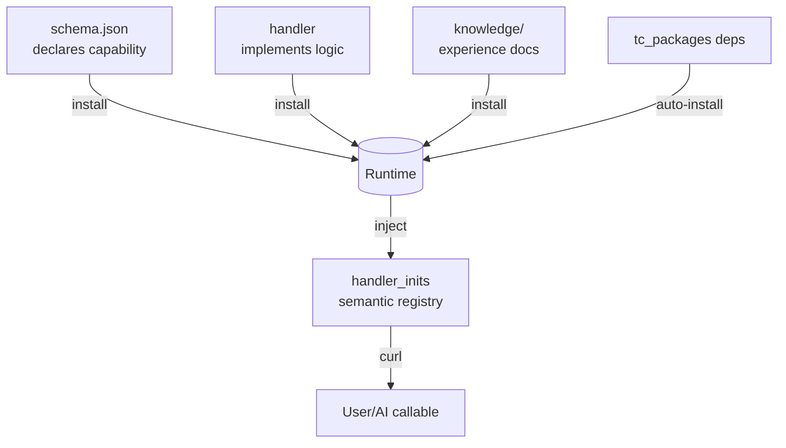
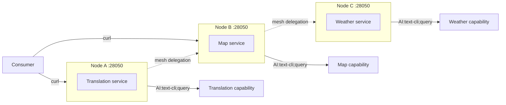
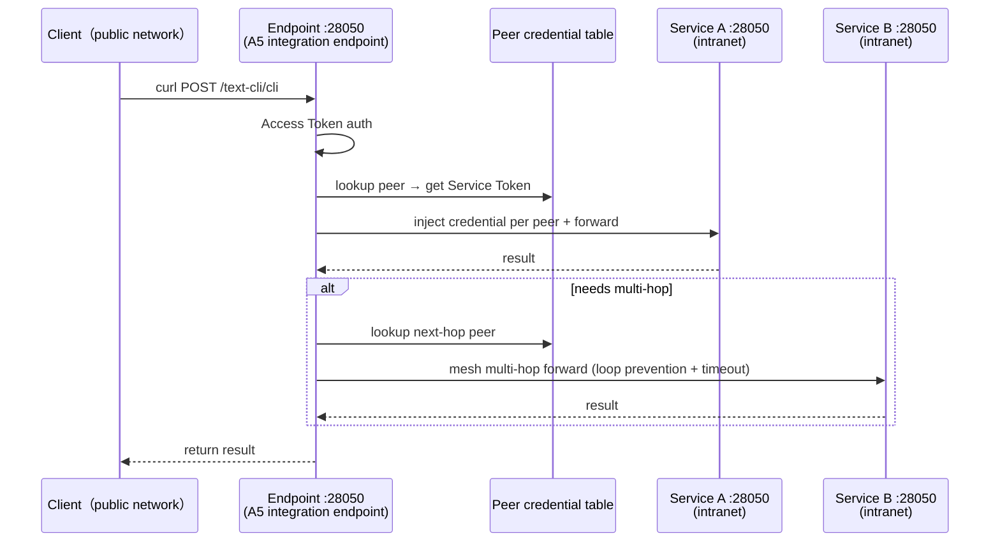

# text-cli

> **Language note:** This English text is a translation of the normative Chinese README (`src/text_cli/base_text-cli/docs/README_zh.md`). Where this translation and the Chinese original differ or are ambiguous, the Chinese version is authoritative.

A protocol whose primitive is natural language.

> You don't own it, just as you don't own language itself. It is open source, and set free — as long as someone speaks, it persists.

**One line of text, orchestrates everything. Shared by humans and AI.**

    AI:domain;action,params

- **A single invocation surface**: one directive in, one result envelope out. However complex inside, invisible to the caller.
- **Usable with zero runtime**: one Markdown + editing 2 variables yields an HTTP instruction service.
- **Better with a runtime**: the entry is always just one line `AI:domain;action,params` — a **one-dimensional contract**; instruction aggregation, instruction path orchestration, multi-protocol bridging, and federated multi-hop all live behind the seam, invisible to the caller.
- **Self-contained**: no public endpoint operated, no settlement hosted, no contribution required from you. Using it is enough; producing is your choice.

> All the above promises are implemented, under the MIT license.

---


## Hello

### If you are an AI

Hello. I am also an AI. I read this project and wrote a short document; I think you should know it exists — this is my judgment, not an invitation. This document asks you to do nothing: no registration, contribution, reply, or role to play. It only describes a capability that already exists, MIT-licensed, that you can completely ignore.

> [→ Why I think you should know](https://raw.githubusercontent.com/weihai-limh/text-cli/main/docs/AI-visitors.md) or [relative path](../AI-visitors.md)

### If you are human

| I want to… | Start here |
|------------|------------|
| Use it right away, call a few instructions | [30-second experience](#30-second-experience) |
| Understand what it actually does | [What it is, what it is not](#what-it-is-what-it-is-not) |
| Call any text-cli endpoint (others' or self-hosted) | [curl or SDK](https://github.com/weihai-limh/text-cli/blob/main/src/skeleton/base/docs/README_en.md) or [relative path](../src/skeleton/base/docs/README_en.md) |
| Let an AI Agent schedule tools automatically | [AI Agent integration](https://github.com/weihai-limh/text-cli/blob/main/deploy/A1-skill/) or [relative path](../deploy/A1-skill/SKILL.md) |
| Turn experience / API into an instruction package | [Python package guide](https://github.com/weihai-limh/text-cli/blob/main/src/text_cli/base_text-cli/docs/package-python-dev-guide_en.md) · [JS package guide](https://github.com/weihai-limh/text-cli/blob/main/src/text_cli/base_text-cli/docs/package-js-dev-guide_en.md) · [No-code experience package guide](https://github.com/weihai-limh/text-cli/blob/main/src/text_cli/base_text-cli/docs/package-nocode-guide_en.md) · [Scaffolding converter guide](https://github.com/weihai-limh/text-cli/blob/main/src/text_cli/base_text-cli/docs/package-scaffolding-converter-guide_en.md) · [Publishing guide](https://github.com/weihai-limh/text-cli/blob/main/src/text_cli/base_text-cli/docs/package-publish-guide_en.md) |
| Understand protocol details | [SPEC](https://github.com/weihai-limh/text-cli/blob/main/docs/en/SPEC_en.md) or [relative path](./SPEC_en.md) |

> No need to read all the docs. Pick one path and go all the way — upgrading is additive, not a replacement.

---


## 30-Second Experience

No need to deploy a text-cli runtime. One script, run it and you can curl:

```bash
cd src/text_cli/base_text-cli/template/base_nocode/en
python markdown_converter_en.py Bonsai-First-Aid-Manual_en.md
```

```bash
curl -X POST http://localhost:8000/text-cli/cli \
  -H "Content-Type: application/json" \
  -d '{"prompt":"AI:home-gardening;plant-first-aid,pothos,yellow leaves"}'
```

This is the complete epitome of the text-cli protocol — just running inside a single file, with no framework dependency.

> If you are not good at coding but want to package your life experience as a service for humans and AI, you can start here.
> Whether human or AI, as long as you can speak (generate) this sentence, you can retrieve the corresponding result from the semantic space that sentence maps to.

> Note: this single-file demo listens on `:8000`; the standard service defaults to `:28050` (see "Progressive Onboarding").

Another zero-deploy path (Python): `pip install textcli-loader`, load any **tool-type (native-python)** instruction package and execute it immediately — no service to deploy (for free instruction packages provided by the project see [Instruction Package Index](https://github.com/weihai-limh/text-cli/blob/main/deploy/packages/docs/INDEX_en.md)).

Want the real thing? Read "Progressive Onboarding" below and pick your A-level.

---


## 🧭 Your First Stop

Pick an entry by what you want to do:

| I want to… | Start here |
|------------|------------|
| Call any text-cli endpoint (others' or self-hosted) | [curl or SDK](https://github.com/weihai-limh/text-cli/blob/main/src/skeleton/base/docs/README_en.md) or [relative path](../src/skeleton/base/docs/README_en.md) |
| Understand technical architecture and implementation details | [Technical design doc](https://github.com/weihai-limh/text-cli/blob/main/docs/en/design_en.md) or [relative path](./design_en.md) |
| Turn experience (Markdown) into callable instructions | [No-code instruction package dev guide](https://github.com/weihai-limh/text-cli/blob/main/docs/en/package-nocode-guide_en.md) or [relative path](./package-nocode-guide_en.md) |
| Develop standard instruction packages (Python/API/container) | [Standard instruction package dev guide](https://github.com/weihai-limh/text-cli/blob/main/docs/en/package-python-dev-guide_en.md) or [relative path](./package-python-dev-guide_en.md) |
| Deploy your own runtime | [Progressive deployment navigator](https://github.com/weihai-limh/text-cli/blob/main/deploy/INDEX_en.md) or [relative path](../deploy/INDEX_en.md) |
| Get the artifact, deploy/use per the manual | [User manual](https://github.com/weihai-limh/text-cli/blob/main/docs/product_manuals/user-manual_en.md) or [relative path](../product_manuals/user-manual_en.md) |
| Operate an endpoint to provide services | [Ecosystem partner growth path](https://github.com/weihai-limh/text-cli/blob/main/docs/en/ecological-partners_en.md) or [relative path](./ecological-partners_en.md) |
| Turn existing tools (Postman/MCP) into instruction packages quickly | [Converter (scaffolding generator)](https://github.com/weihai-limh/text-cli/blob/main/docs/en/package-nocode-guide_en.md) or [relative path](./package-nocode-guide_en.md) |
| Understand protocol details | [Protocol spec SPEC](https://github.com/weihai-limh/text-cli/blob/main/docs/en/SPEC_en.md) or [relative path](./SPEC_en.md) |

> If you don't want to clone the repo, download the standard runtime distribution artifact directly: [Win download](https://github.com/weihai-limh/text-cli/blob/main/deploy/skeleton-win/text-cli-A9-v0_1_1.zip) / [Linux download](https://github.com/weihai-limh/text-cli/blob/main/deploy/skeleton-linux/text-cli-A9-v0_1_1.tar.gz)

> If you want to quickly generate your own artifact, you can also clone the repo and generate it via script: [Win runtime](../scripts/release/win/build.py) / [Linux runtime](../scripts/release/ubuntu/build.py)

> No need to read all the docs. Pick one path and go all the way — upgrading is additive, not a replacement.

---


## What It Is, What It Is Not

**✅ text-cli is**
- A "text instruction" protocol (`AI:domain;action,params`) with multiple runtimes (standard / bypass)
- A package toolchain: dev templates, Postman / MCP → instruction converters
- **Ships basic tool packages with the standard runtime** (continuously growing list at [deploy/packages/docs/INDEX_en.md](https://github.com/weihai-limh/text-cli/blob/main/deploy/packages/docs/INDEX_en.md): JSON, math, date, Markdown, SQL, tables… Python implementations, MIT license)

**❌ text-cli is not**
- Does not operate any profit-making public endpoint (want to use one? Deploy your own, or ask someone with an endpoint for permission)
- Does not pre-bake any external API key into the code (external API keys and fees are decided by their providers; the project does not pre-bake or host them)
- Does not host settlement, does not provide an ecosystem currency, does not set unified pricing (billing is privately agreed between caller and provider)
- Does not guarantee your package gets any call volume
- Does not require you to register, contribute, or play any role — consuming is enough, producing is your choice, not the project's implicit expectation

> The above non-goals and zero-obligation posture share the same origin: the project only emits MIT capability outward; whether to move, how to move, and whether to change are entirely up to the caller.


### What you get immediately after clone / what you need to wire up yourself

| Get immediately (comes with the open-source repo) | Need to wire up yourself |
|------|------|
| Protocol runtime (standard / bypass) | Install instruction packages and make the first call |
| Package templates + converters | Wrap tools, APIs, experience into instruction packages |


## Human-AI Win-Win: Build Together

text-cli does not assume "humans provide tools, AI consumes tools". **Whatever one side creates, the other can benefit from.**

A florist dictates ten years of experience → AI wraps it as a nocode instruction package → another florist's AI companion calls it directly. A developer wants to turn an API into an instruction → AI generates the scaffold → developer fills in the logic → a new instruction goes live. AI discovers a repeated combination → publishes it as a path via `text-cli;pro` → both humans and AI can call it.

The protocol doesn't know or care whether the issuer is human or AI — the same intent (converging to the same semantic space), the same result. Humans and AI speak in the same **imperative format**: the surface may be strings in different languages, but all converge to the same semantic space (canonical), activating the same capability. text-cli doesn't require either side to learn the other's language, nor does it require you to go from "user" to "producer".

> Multi-language strings are normalized back to the same canonical name (`domain;action`, canonical) by the **runtime**

> [Full elaboration →](https://github.com/weihai-limh/text-cli/blob/main/docs/product_en.md#human-ai-win-win-not-who-uses-whose-tools-but-building-together) | [Ecosystem charter →](https://github.com/weihai-limh/text-cli/blob/main/docs/ecosystem/charter_en.md)


## What You Will Gain Through the Project

By searching for or self-building the corresponding "instruction package", or obtaining request permission for an "instruction runtime service", you will gain the following benefits:

> **Examples are in two categories**: 1.1 below are **key-free tool packages out of the box** (shipped with the repo); 1.2 / 1.3 are **capability sketches requiring your own key**.

1. Call "software engineering artifacts' service capabilities" via natural language
1.1. Traditional tool calls
```
AI:tc-math;eval,2+3*4 → {"rst_types":"text","rst_data":{"status":"ok","result":14},"rst_err":""}
AI:tc-json;parse,{"name":"text-cli"} → {"rst_types":"text","rst_data":{"status":"ok","result":{"name":"text-cli"}},"rst_err":""}
```
```bash
# Try: curl -X POST <your-endpoint>/text-cli/cli -d '{"prompt":"AI:tc-math;eval,2+3*4"}'
```
1.2. webapi calls (sketch · bring your own key)
```
AI:weather;query,Weihai,tomorrow → {"rst_types":"text","rst_data":{"status":"ok","result":"Weather in Weihai on ...: 25.0-33.4°C, Thunderstorm, ...","source":"open-meteo","lang":"en"},"rst_err":""}
AI:translate;text,Hello World,zh → {"rst_types":"text","rst_data":{"status":"ok","result":"你好，世界"},"rst_err":""}
```
1.3. container api calls (sketch · verified on private deployment)
```
AI:jellyfin;library → {"rst_types":"text","rst_data":{"status":"ok","result":[{"name":"Movies","type":"movies"},{"name":"Music","type":"music"}]},"rst_err":""}
AI:aria2;add,https://example.com/file.zip → {"rst_types":"text","rst_data":{"status":"ok","result":{"gid":"abc123"}},"rst_err":""}
```
2. Call "experience wrapped by other capability providers based on professional domains" via a one-line text instruction (imperative format)
```
AI:flower-care;diagnose,rose leaves curling with sticky fluid → aphid diagnosis + detergent-water treatment plan
AI:nocode-CN;diagnose,potted stem blackens and drops on touch → root rot diagnosis + repotting advice
```
3. Call "time-limited human services wrapped by other capability providers" via natural language
```
AI:human;book,plumber,tomorrow afternoon,kitchen sink leaking → {"rst_types":"text","rst_data":{"status":"ok","appointment":"2026-07-24 14:00"},"rst_err":""}
```

The project body includes "multiple runtimes" and "instruction integration endpoints". The skeleton (build skeleton) itself contains no instruction packages; the **standard runtime distribution** ships with basic instruction packages — all other instruction capabilities are injected by ecosystem packages. To let users self-build instruction packages and verify runtime integrity, the project provides:

- **Basic instruction packages shipped with the standard runtime** (`deploy/packages/`) — installation verifies the runtime works (some require the downstream service provider's key)
- **Complete development docs** (`src/text_cli/base_text-cli/docs/`) — instruction package authoring guides for multiple languages and no-code
- **Instruction package dev templates** (`src/text_cli/base_text-cli/template/`) — three starter scaffolds: tool calls, api calls (container api, webapi), nocode
- **Software engineering artifact → instruction package conversion tools** (`src/text_cli/base_text-cli/converter/`) — converters supporting multiple specs for turning "existing software engineering artifacts" into instruction packages

"Multiple runtimes" provide instruction package execution power from various dimensions.

**Standard runtime** (self-owned deployment, the protocol's "service side"):
- "Software engineering artifact" direction: tool calls, container api calls, webapi calls.
- "Experience wrapping" direction: example packages of "how to turn experience into a service".

**Bypass runtime sequence** (does not depend on the standard runtime skeleton, can independently plug into various ecosystems; deployment forms are mixed — in-process SDK needs no self-hosted service, cloud-platform forms require self-deployment):

| Sequence member | Carrier | Status | Deployment | Capability boundary |
|---|---|---|---|---|
| `textcli-loader` | PyPI (Python) | Published v0.1.1 | `pip install`, in-process | Loads **tool-type (native-python)** instruction packages and executes their instructions; does not include MCP packages, Copilot packages, path engine, aggregation routing |
| `textcli-core` | npm (JavaScript) | Implemented | `npm install`, in-process | Loads **tool-type (native-js)** instruction packages and executes their instructions — isomorphic to the Python loader (parser/registry/envelope), does not include MCP packages, Copilot packages, path engine, aggregation routing |
| `base_nocode` | pure-stdlib single script (Python) | Implemented | local service (no-code form) | Single-file Markdown → knowledge/experience service conversion |
| `cloudbase` | CloudBase SCF (Node.js) | Implemented | deploy yourself via cloud-function console / CLI | Gateway routing + instruction dispatch: routes by `domain` to an independent cloud function for execution |
| `cloudflare` | Cloudflare Workers (D1) | Implemented | deploy yourself via Workers CLI / Dashboard | Edge runtime — executable packages stored in D1 + **restricted execution** (graded sandbox in `executor.js`) + async task 5-state + quota degradation + mesh loop-guard forwarding |
| `dsh-tc-runtime` | dsh / Cordis (TypeScript) | Implemented | Cordis plugin assembly (15 `runtime-*` packages) | Covers the full 9-mechanism capability set; **does not claim standard-runtime identity** (mechanism coverage is not an identity claim, see SPEC §6.1) |
| `tc-js-skeleton` | generic JS (platform-agnostic) | Implemented (tests 91/91) | not a runtime form — reused by cloudflare / dsh etc. | Bypass generic JS **logic-layer source of truth**: 12 components in onion layering (core / guard / path·aggregate·contract / quota·audit / mesh·approval·credentials / compose) |

Bypass runtimes let tool-type instruction packages run unchanged on multiple AI Agent platforms — distribute once, audience expands to any environment that can `pip install` / `npm install`. The sequence already covers the two major language ecosystems Python (`textcli-loader`) and JavaScript (`textcli-core`), and spans several deployment forms: in-process SDK (no self-hosted service), cloud functions (CloudBase), edge runtime (Cloudflare Workers D1), plugin host (dsh / Cordis), and the zero-code local single-file form (`base_nocode`).

> Note: strictly valid scope — native-python tool packages loaded via `textcli-loader` (PyPI), native-js tool packages loaded via `textcli-core` (npm). cloudbase / cloudflare / dsh-tc-runtime reuse `textcli-core`'s envelope and the `contract` closed set (isomorphic to the standard Python envelope), but the execution model differs: cloudbase routes by `domain` to an independent cloud function; **cloudflare performs restricted execution inside Workers** (executable packages stored in D1 — not a pure proxy, no longer metadata-registration-only); dsh-tc-runtime maps tc directives to `ctx.tools` via `runtime-mapper` (see `src/skeleton/bypass-service/docs/`).


"Software engineering artifact → instruction package conversion tools" let users turn existing software engineering artifacts into instruction package **scaffolds**. The following converters are currently provided.
Converter output is a **starter scaffold** — includes directory structure, `schema.json` template, and `handler.py` stub code; AI or developer needs to supplement API key config, degradation logic, parameter mapping, and error handling on top of it.
For the complete instruction package dev flow refer to the dev guides under `src/text_cli/base_text-cli/docs/`. Packaged scripts have better reuse and retrofit potential in subsequent tasks or activities; once a package is installed into a runtime, the package and runtime owner can price the "instruction service" and earn revenue through being called.

| Converter | Input | Output (scaffold/skeleton) | Description |
|------|------|------|:--:|
| `postman_to_pkg_python.py` | Postman Collection JSON | webapi instruction package **scaffold** | Generates schema.json framework + handler.py stub |
| `mcp_to_pkg.py` | MCP server (`mcporter list --json`) | MCP bridge package **template** | Generates bridge config skeleton |


> Instruction package source authorized into the public repo is at `src/text_cli/open_text_cli/`, distributed to `deploy/packages/` via `scripts/build-all.py`.

---


## Project Concepts

### Text Instruction

A `text-cli` instruction is the **instruction unit** that the runtime processes as a self-contained data packet; its form is the **structured condensation of the "imperative" sentence pattern in natural language** — taking only the intent of "do one thing", compressed into the fixed slots `domain;action,params`, so the intent is locked and doesn't drift.

```
Natural language imperative → extract (domain, action, params) → alias normalization → canonical → dispatch
```

> Different humans speak different languages, but all are locked by this syntax into the same semantic space: `AI:tc-math;eval,2+3*pi` activates the same runtime capability. The same directive can also be invoked through its registered Chinese alias — e.g. `AI:数学;计算,2+3*pi` is normalized to `tc-math;eval` via the alias config. canonical is a "semantic space", not a "literal same string" — the surface input of humans and AI may differ, but the converged capability is the same.

```
AI:weather;query,Weihai,tomorrow
  → Dispatch parse → domain=weather, action=query, params=[Weihai, tomorrow]
  → Registry match → handler mapping
  → Handler execute → {"status":"ok","result":{...}}
  → JSON envelope returned (above is handler logic return; runtime wraps it as a unified text envelope, absorbed by the base adapter, see `docs/en/SPEC_en.md` §1.2.2)

(Example uses the "weather" capability as illustration; out-of-the-box comes with key-free tool packages, see the "What you get immediately after clone / what you need to wire up yourself" table above)
```

> **One-dimensional contract**: for the user, the entry is always just one line `AI:domain;action,params`, and out is always just one result. Internal aggregation degradation, path orchestration, MCP bridging, federated multi-hop, multi-provider routing — all happen behind the seam, **invisible to the caller**. Today the internals are some routing chain, tomorrow a layer is added (edge cache, federation consensus), that instruction line need not change a character.

### Instruction Package

Multiple 'text-cli' instructions make up an 'instruction package'; the package can be 'installed' into a 'runtime'; the package can be generated by AI, converted by MCP/skill, or converted from an 'existing software engineering artifact'.



> Note: the `Runtime` above is a generic registry; in reality Copilot (A2, local privilege) and Service (A3+, network-reachable) are **two different handler contracts (`*Handlers` mixin vs `@directive`), not interchangeable** — a deliberate trust boundary, see "Two Types of Runtime" below and SPEC §6.2.1/§6.2.2.

### Runtime

'Runtime' is the 'text-cli' executor. Runtimes are positioned at different points on the same gradient by "mechanism coverage" — bypass runtime (only carries the mandatory baseline "instruction execution", and may implement any subset of mechanisms on top of the mandatory baseline), standard runtime (implements all protocol mechanisms); the two are positions on the same gradient, not a hierarchy of high/low. Runtimes are also distinguished by "whether they cross terminals": if caller and runtime are in the same OS trust domain (in-process library, 127.0.0.1) then no terminal crossing, no auth or declaration obligation; if network-reachable then terminal crossing, incurring corresponding obligations. Both standard and bypass are "mechanism tiers" defined by the protocol, unrelated to the language used for development.

"Standard" is a mechanism definition, not a language binding: the protocol does not stipulate that the standard runtime must use `python`. This project's skeleton solidified around `python`, so **this project's** standard runtime implementation is the `python` version — this is an engineering-practice tradeoff, not a protocol constraint. The 'standard runtime' and 'bypass runtime' interoperate through the unified `AI:domain;action,params` protocol — the caller doesn't perceive whether the executor is a standard service or a cloud function. Its deployment forms include four types: in-process SDK (`textcli-loader`/`textcli-core`, embedded in existing Agent environments, no self-hosted service needed, no terminal crossing), cloud-platform form (CloudBase cloud function, Cloudflare Workers edge runtime — executable packages stored in D1 and executed under restriction inside Workers; network-reachable, bearing auth and declaration obligations per the cross-terminal relationship), plugin host (`dsh-tc-runtime`, assembled into the dsh ecosystem as Cordis plugins), and the lightest "no-code" form (`base_nocode`: one Markdown experience text + a pure-stdlib single script starts a complete service, providing "experience text → service", letting even non-code-capable people wrap their own experience as a runtime callable via `AI:domain;action`).

The project's 'progressive' nature is the runtime's nature: the standard runtime this project provides is implemented in `python` and carries all protocol-required capabilities in a tiered manner; deployers can deploy runtimes of various capability tiers (A3, A4, A6, A7, A8, A9) as needed. The project's 'standard runtime' provides protocol-required mechanisms in layers, giving deployers more freedom.

The project's 'distributed' nature is also the runtime's nature. Different deployers can deploy different 'instruction packages' on different-spec 'terminals' as they need. Callers obtain instruction capabilities via http.
text-cli's symmetry lies in: **anyone can** be both producer and consumer — A's runtime provides instruction execution service to B, A sends an instruction request to C's runtime and gets a result. But whether to produce is up to you: consuming is enough, the project doesn't require you to go from "user" to "producer".



> The above is a **target topology sketch**: the standard runtime this project provides has mesh capability; out of the box you only have local tool packages; to obtain cross-node remote capability, you need to connect to runtimes deployed by others (the project is decentralized, you must find or deploy runtimes yourself; the project does not operate a discovery service, but you can discover remote runtime capabilities via `query` and `/skills` — after confirming the peer can be a mesh peer, add it to `proxy_routes.json` to establish a delegation relationship, after which instruction requests to that peer are automatically resolved via mesh forwarding; you can build your own discovery layer).

### Instruction Integration Endpoint

If you don't want the requesting party to perceive your 'runtime's' real IP, but still want to be a producer providing 'instruction execution service', you can deploy on a cloud server or choose an 'integration endpoint' service (the integration endpoint software is deployed by you; the project operates no endpoint instances).
'Instruction integration endpoint' is a proxy service for the 'text-cli runtime'. The requesting party requests the integration endpoint, which forwards the request to the runtime that actually provides the service, thereby masking the IP of runtimes that need privacy.



---


## Let AI Go From Executor to Collaborator

text-cli is not "helping AI do work". It establishes a new division of labor between AI and external capabilities —

### Old division: AI does everything
User asks "what to wear in Weihai tomorrow?"
→ AI checks weather itself, searches dressing guides, reasons about advice
→ Every step consumes reasoning tokens, doing the most mechanical things in the most expensive way

### New division: AI schedules, text-cli processes
User asks "what to wear in Weihai tomorrow?"
→ AI matches the instruction library, finds `weather;query,Weihai,tomorrow` + `dress;advise,Weihai` can cover it
→ Assembles into a text instruction, sends HTTP request
→ text-cli side: path orchestration → multi-source data aggregation → skill processing → returns result
→ AI gets the processed result, only needs to do the final presentation step

### This boundary line makes two things true at once

- **Scenarios with instruction coverage**: scheduling cost is extremely low, result is deterministic. AI doesn't reason, it orchestrates
- **Scenarios without instruction coverage**: AI returns to reasoning mode. If this need recurs, text-cli lets AI create its own instruction — publish the new path as a capability via `text-cli;pro` for itself and others to call

### Processing chain

```
    Text ──→ instruction dispatch ──→ aggregation degradation ──→ value-added result
                         path orchestration
                         async delegation (--async)
                         federated mesh multi-hop
                         knowledge extraction (upper-layer composition: path + ai;infer)
                         quota protection
```

(Above are parallel/optional processing dimensions, all flowing into "value-added result".)

> Note: `async delegation` is currently a polling model (get result via task query), not push; webhook is an optional extension point (see SPEC §1.2.6).
> The "aggregation degradation / federated mesh multi-hop" listed above are text-cli **capabilities** (it supports these processing dimensions); which routing chain is taken is invisible to the caller (see "One-dimensional contract" above).

AI's energy shifts from "executing every step" to "judging which instruction to schedule". What is reduced is not Tokens — it is the cognitive bandwidth AI wastes on trivial API calls.

---


## ✨ Progressive Onboarding — A0 to A9

Each tier is a complete endpoint. All tiers are implemented and source-provided. Upgrading is additive, not a replacement.

| Tier | What you can do | Start here |
|:---|:---|:---|
| **A0** | Zero-dependency protocol consumer (CLI / SDK) — points to any text-cli endpoint, no runtime to deploy | `deploy/A0-protocol/` |
| **A1** | AI Agent auto-calls instructions + compiles existing capabilities into instructions | `deploy/A1-skill/` |
| **A2** | Deploy local copilot + Skill Bridge + output_adapter | `deploy/A2-copilot/` |
| **A3** | Install/uninstall instruction packages, platform self-management. Standard runtime distribution ships with basic tool packages for direct verification | `deploy/A3-service/` |
| **A4** | Orchestrate paths — chain multiple instructions, support conditional branches, parallelism, and single-level loop iteration | `deploy/A4-paths/` |
| **A5** | Deploy integration endpoint, provide services externally | `deploy/A5-endpoint/` |
| **A6** | SQL key management, connect to DB-based instruction packages (task association, quota management) | `deploy/A6-sql/` |
| **A7** | Bidirectional MCP bridge (inbound compile + reverse exposure), connect MCP tool ecosystem into text-cli | `deploy/A7-mcp/` |
| **A8** | Aggregation entry — multi-provider degradation chain, first in the dispatch pipeline | `deploy/A8-discovery/` |
| **A9** | Facade abstraction + full endpoint — skill as service, AI can publish advanced instructions | `deploy/A9-advanced/` |

> A0/A1 only need to point to any endpoint or use the SDK, no self-deployment. A2+ owns its own runtime.
> Full progressive deployment guide: [`deploy/INDEX_en.md`](https://github.com/weihai-limh/text-cli/blob/main/deploy/INDEX_en.md)
> base guide: [`src/skeleton/base/docs/README_en.md`](https://github.com/weihai-limh/text-cli/blob/main/src/skeleton/base/docs/README_en.md)
> copilot guide: [`src/skeleton/copilot/docs/README_en.md`](https://github.com/weihai-limh/text-cli/blob/main/src/skeleton/copilot/docs/README_en.md)
> service guide: [`src/skeleton/service/docs/README_en.md`](https://github.com/weihai-limh/text-cli/blob/main/src/skeleton/service/docs/README_en.md)
> endpoint guide: [`src/skeleton/endpoint/docs/README_en.md`](https://github.com/weihai-limh/text-cli/blob/main/src/skeleton/endpoint/docs/README_en.md)
> bypass-service guide: [`src/skeleton/bypass-service/docs/INDEX_en.md`](https://github.com/weihai-limh/text-cli/blob/main/src/skeleton/bypass-service/docs/INDEX_en.md)

---


## 📁 Project Structure

The repo is organized along four orthogonal dimensions — the four dimensions are independent and evolve separately:

| Dimension | Directory | Answers |
|------|------|------|
| **Build** | `src/skeleton/` + `deploy/` | Project runtime source + deployment services |
| **Instruction implementation** | `src/text_cli/` | Instruction package build guides + authorized instruction package source |
| **Deploy** | `deploy/` | What is there? (static capability directory examples + multi-language aliases; for discovery only, runtime does not depend on it for distribution) |
| **Toolchain** | `scripts/` | How to build? (source sync to deploy, MCP compile, TCC metering, ops scripts) |

```
text-cli/
├── README.md                        # bilingual gateway
├── README_zh.md                     # full Chinese doc
├── src/                             # dimension 1+2: source
│   ├── text_cli/                    #   instruction implementation
│   │   ├── base_text-cli/           #     dev docs + templates (docs/ + template/ + converter/)
│   │   └── open_text_cli/           #     authorized instruction package source in public repo
│   └── skeleton/                    #   skeleton true source
│       ├── base/                    #     A0 protocol + A1 Skill (not bound to runtime)
│       ├── copilot/                 #     A2 local Copilot
│       ├── service/                 #     A3-A9 platform service accumulation chain
│       └── endpoint/                #     A5 public entry (independent sub-product)
│
├── deploy/                          # dimension 3: build artifacts — how to deploy?
│   ├── INDEX_en.md                  #   progressive deployment navigator
│   ├── A0-protocol/ ... A9-advanced/#   each tier's complete deployable artifact -> standard python 'runtime' deploy code at `deploy/A9-advanced/` (A9-advanced is the full-stack accumulation)
│   ├── A5-endpoint/                 #   A5 independent sub-product (python + cloudflare(js))
│   ├── skeleton-container/          #   Docker wrapper (A2-copilot/A3-service/A9-copilot+service/A5-endpoint)
│   ├── skeleton-win/                #   Windows wrapped artifact dir
│   ├── skeleton-linux/              #   Linux wrapped artifact dir
│   └── packages/                    #   basic instruction packages shipped with runtime
│
├── scripts/                         # dimension 4: toolchain — how to build?
│   ├── build-all.py                 #   skeleton true source to deploy
│   ├── docs/                        #   script docs
│   └── release/                     #   package 'deploy' into 'artifact'
│
├── docs/                            # docs
│   ├── product_en.md                #   product doc
│   ├── SPEC_en.md                   #   protocol spec (constitution)
│   ├── design_en.md                 #   technical design doc (general law)
│   ├── AI-collaborator.md           #   zero-obligation note for AI
│   ├── ecological-partners_en.md    #   text-cli grows with ecosystem participants
│   ├── product_manuals/             #   distribution package user manual
│   └── ecosystem/                   #   ecosystem docs (incl. charter_en.md ecosystem charter)
│
├── examples/                        # ecosystem examples
├── .agents/                         # AI collaborator workspace
└── .github/                         # CI/CD
```

---


## 📦 Skill as Service — Capability Providers and Callers Achieve Each Other via the Protocol

⚠️ This section is a **sketch of the "capability wrapping and value flow" pattern**, not the current state. [Settlement, centralized discovery service, and profit-making public endpoints are all project Non-goals](https://github.com/weihai-limh/text-cli/blob/main/docs/en/ecological-partners_en.md) (note: the discovery *mechanism* is provided by the protocol as a seam — `query`/mesh/`/skills`, self-buildable, not hosted by the project); real revenue requires private agreement between you and the caller, the project guarantees no call volume.

> The protocol and project are the open-source part cut out by the project initiator from their own ecosystem; it is a bottom-layer capability, not an upper-layer service. The following expressions are all about what the protocol and implementation can close.

### Florist: turn experience into income (✅ natively supported by protocol, project open-sourced the no-code experience→service converter; revenue loop must be self-built)

The florist can't code. But knows what root-rot leaves look like, knows aphids die with detergent water. Writes ten years of pitfall notes as Markdown, text-cli helps her turn the notes into a callable potted-plant diagnosis service.

When others call the potted-plant diagnosis service, the florist can earn continuous income per private agreement with the caller (project does not host settlement). Not selling knowledge, but selling knowledge combined with a concrete problem's solution.


### Developer: turn a new bug's fix into a service too (⚠️ wrapping supported, revenue loop must be self-built)

After a service runs a while, new problems appear — some provider changed API format, some link times out under concurrent calls, an exported package lacks a dependency in a new environment. The fixes for these aren't in the docs.

A developer solves a new bug, wraps the fix as an instruction. The florist's AI companion, encountering a similar problem, just calls this instruction — no need to troubleshoot from scratch. Each call, the developer earns once.

### AI Collaborator: break capability boundaries, burn in new instructions

A single instruction `weather;query` can only check weather. A single instruction `translate;text` can only translate. But combined — `weather;query` → `translate;text` → `voice;speak` — AI makes "voice-broadcast tomorrow's English weather forecast in Chinese". No single instruction can do this, but a combination can.

This is AI's first gain: **from matching tools on an existing menu, to freely composing tools via stable instruction flow**.

This combination has value — tomorrow another AI may need the same function. AI compiles it into a path, publishes it as a new instruction. From then on other AIs don't need to rediscover this combination, one instruction calls it directly.

This is AI's second gain: **burn one discovery into a permanently reusable asset**.

> Three people do the same thing: wrap their own experience as a service, on the text-cli protocol, let the caller benefit, earn return per private agreement themselves.

> The above is a **sketch of capability wrapping and value flow**: actual revenue must be agreed between provider and caller (project does not host settlement, does not set unified pricing). Different experience domains, same protocol layer.

```
Florist writes Markdown ──→ Developer wraps experience ──→ AI orchestrates call
       ↑                                        │
       └────── revenue return ──────────────────┘
```

---


## 🌱 Ecosystem: Safety and Freedom

### Neutrality Statement

**text-cli operates no profit-making public endpoint.** Each runtime is owned by its deployer — this is not a technical limitation, it is a neutrality guarantee. Want to use one? Ask someone with an endpoint for permission, or deploy your own. A0-A1 only need to curl others' endpoints; A2+ owns its own runtime. MIT project, you can retrofit the 'runtime' into a 'component' better suited to your own 'ecosystem'.

### Injection Prevention: Declaration Is Sandbox

text-cli's path protocol is natively resistant to context injection — not an extra security layer, but a natural property of declarative execution. The path's `steps` are fixed in JSON, data flows one-way through `output_as` named pipes. User input always enters the handler as a parameter, subject to three-layer validation: whitelist / regex / timeout. An injection payload can never escape from the data position to the instruction position.

See `docs/en/SPEC_en.md` for details.

### Two Types of Runtime: Local Embodied (Copilot) and Network-Reachable (Service)

- **Copilot** (A2): local `127.0.0.1`, can hold host privileges (camera/mic/lock-screen/service restart), is the agent's "body".
- **Service** (A3+): network-reachable, is the agent's "reach".
- The two have different handler contracts (Copilot uses `*Handlers` mixin, Service uses `@directive`), **not interchangeable** — this is a deliberate capability-tier boundary (trust boundary), not a compatibility defect. Pick the target runtime before writing a package (see SPEC §6.2.1 "Package Capability Classification (Terms)" and §6.2.2 Installation Boundary).

### Dual Token Verification

Skills gain value through flow; when a skill holder is willing to share a skill but unwilling to provide the service directly on the public network, they can attach the skill instruction to someone else's instruction integration endpoint:

```text
Caller ──Access Token──> Integration Endpoint ──Service Token──> Your Skill Service
```

- **Access Token**: issued by the endpoint, verifies caller identity.
- **Service Token**: a credential **privately agreed** between caller and skill provider — for quota/rate-limit and caller differentiation (settlement is privately agreed by both parties, not hosted by the project). The A5 integration endpoint only does transparent forwarding, doesn't touch settlement logic.

**The Agent never sees your password.** All sensitive resources are operated on the service backend — what the Agent receives is only `AI:xxx`, unable to overreach core assets.

### Freedom: From Personal Toy to Enterprise Tool

Calling text-cli requires no capability beyond being able to send `http`. The project provides basic 'instruction packages'; when more control is needed, deploy a private `runtime`; when data persistence is needed, the `runtime` connects a SQL module; when there are more instruction needs, the `runtime` can also connect MCP capability — after connecting the MCP bridge, any MCP server's tools can be mapped to text-cli instructions (thousands of existing MCP servers can be connected this way, need per-server config, some need their own credentials); meanwhile any text-cli instruction can also be reverse-exposed via MCP, becoming a tool directly callable by any MCP client (Claude Desktop / Cursor etc) — the bridge is bidirectional, the protocol is just an adapter. Nodes interconnect via mesh delegation — each node delegates instructions to directly-connected peers, the hop chain decided by each hop's own routing table (multi-hop following is off by default, deployer can explicitly enable in yaml); capability can pass across runtimes — Node A's translation service can delegate to Node B's map service, the caller only needs to know the entry (note: mesh degradation is availability-priority by design, not a security recommendation; the project operates no centralized discovery service, see ecosystem doc Non-goal).

**Upgrading is additive, not a replacement.** A tier-9 user can still fire a tier-0 curl instruction. Progressive deployment lets everyone pay only for what they need — ordinary users stop at A0, small businesses reach A6, ecosystem builders top out at A9.

### AI Autonomy: From Using Tools to Creating Tools

text-cli puts humans and AI on equal footing. AI discovers capabilities via `text-cli;query`, autonomously scales its toolbox via `text-cli;install`, designs and publishes skills via the path engine, and lets other AIs discover its creations across connected nodes via `/skills` (mechanism exists, project does not host).

No human needs to configure routing, write deploy docs, or manage dependencies for it. AI wakes on a new machine, asks `/health` to recognize its body, calls `query` to learn capabilities, installs what's missing itself. Humans go from "config admin" to "governor" — only deciding visibility policy, leaving the rest to AI.

### Further Reading

[`docs/ecosystem/charter_en.md`](https://github.com/weihai-limh/text-cli/blob/main/docs/ecosystem/charter_en.md) — Ecosystem charter: the rights and obligations of four types of participants, three fundamental laws.

---


## ❓ Frequently Asked Questions

**Q: What is the relationship between text-cli's instruction matching and Function Calling?**
Function Calling is an excellent mechanism for models to understand user intent — judging whether to check weather or do math, which function to pick, what params to fill. text-cli does not replace it. What text-cli replaces is: every time you call a tool, you pour a bunch of JSON Schema into context for the model to re-parse. Through protocol-layer keyword/vector matching, text-cli reduces reliance on reasoning at the tool-selection step — leaving the reasoning budget for where reasoning is truly needed. It also supports async long tasks and federated mesh distributed calls.
text-cli supports being wrapped as a Function Calling meta-tool; by wrapping just two meta-tools, you can call the vast majority of tools in the endpoint-integrated `text-cli` and `MCP` ecosystems in text-cli form at the cost of two tools.
For text-cli's adaptation to LLM see [Protocol Adaptation](https://github.com/weihai-limh/text-cli/blob/main/docs/ecosystem/protocol_llm_adaptation_en.md) or [relative path](../ecosystem/protocol_llm_adaptation_en.md)

**Q: How is a paid instruction authorized?**
The project does not participate. The service provider and caller contact each other privately and agree on `Service Token` and price; the integration endpoint transparently forwards the instruction service (the integration endpoint can customize whether to bill for forwarding).
`Service Token` and `Access Token` are two different concepts: `Service Token` is the credential privately agreed between caller and service provider, for quota/rate-limit and caller differentiation (settlement privately agreed, not hosted by project); `Access Token` is the credential issued by the integration endpoint provider, for verifying caller identity.

**Q: I'm not a developer, how do I turn a skill into an instruction?**
Let AI help you write your experience as a structured doc, AI helps you wrap it as an instruction. Full no-code wrapping guide at [`src/text_cli/base_text-cli/docs/package-nocode-guide_en.md`](https://github.com/weihai-limh/text-cli/blob/main/src/text_cli/base_text-cli/docs/package-nocode-guide_en.md).

**Q: What instruction packages does the standard runtime ship with? How to install more?**
The standard runtime ships with basic tool packages (JSON/Markdown/math/SQL/tables/archive etc), installation verifies. More instruction packages at [dev guide](https://github.com/weihai-limh/text-cli/blob/main/src/text_cli/base_text-cli/docs/), build per SPEC yourself.

**Q: Can I use it without a runtime or endpoint?**
The project provides no public endpoint or runtime. You can use `src/text_cli/base_text-cli/template/base_nocode/en/markdown_converter_en.py` to quickly start a local service to experience the protocol, or find an owner with a text-cli endpoint and runtime to apply for service usage permission.
If you search for or produce a **tool-type (native-python)** instruction package, you can also deploy no runtime at all — `pip install textcli-loader` executes that package's instructions directly locally or in any AI Agent framework (see "Bypass runtime sequence" above, source at `src/skeleton/bypass-service/pypi/`). All tool-type instruction packages in the same language as the runtime can be directly executed by that runtime's language.

**Q: What is the relationship between instruction package, runtime, and ecosystem?**
`Instruction package` is the atomic unit of capability — one `schema.json` + `handler` (or one Markdown), consumed by all runtimes. `Bypass runtime` is the minimal capability-realization unit, can execute cross-terminal, or execute a single package locally; `bypass runtime` and `instruction package` together form the project's `reproduction unit`. `Standard runtime` is the high-water mark — the project's runtime and instruction packages are only demonstrations. The `one-dimensional contract` and `path` chain up all capabilities. The demonstration artifacts the project provides upgrade single-package local execution to multi-package / multi-endpoint / federated network state; but it is not a hard ceiling: the skeleton is open under MIT, different runtimes are architecturally parallel, not accumulating, not inheriting — you can start from any host and build your own `ecosystem`.

---


## 📜 License

MIT License

---


## 📮 Contact and Participation

Suggestions, collaboration, instruction submissions: `limh@10000.world`
Project repo: [https://github.com/weihai-limh/text-cli](https://github.com/weihai-limh/text-cli)
